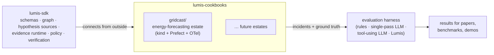

# Lumis cookbooks

Runnable, production-shaped systems for developing, testing and demonstrating
[Lumis](https://github.com/soloshun/lumis-sdk), evidence-grounded operational intelligence
for data and AI infrastructure.

The SDK repository holds the primitives. This repository holds the **worlds they are tested
in**: complete estates with real services, real telemetry and reproducible failures, so Lumis
is exercised against systems it did not shape. Each cookbook is self-contained, runs locally,
and keeps ground truth hidden from the system under test.



## Cookbooks

| Cookbook | What it is | Status |
|---|---|---|
| [gridcast](gridcast/README.md) | Short-horizon load forecasting for a synthetic national grid: weather/demand vendors, ingestion, features, probabilistic model, validation gate, dispatch plans; 10 injectable incidents (A–J) | Estate complete; Lumis integration and experiments in [gridcast/lumis](gridcast/lumis/README.md) |

## Quick start (GridCast)

```bash
brew install uv kind kubectl      # plus Docker Desktop with >= 8 GB memory
cd gridcast
make up                           # ~5-10 min the first time
make verify                       # 12 end-to-end checks
uv run gridcastctl chaos inject A # break something realistically
```

See [gridcast/README.md](gridcast/README.md) and [gridcast/docs](gridcast/docs) for
architecture, infrastructure, data model, observability, scenarios, operations and testing.

## Principles

* **Separate repositories in spirit.** An estate never imports Lumis; Lumis never imports an
  estate. They meet only through standard interfaces: Kubernetes, OpenTelemetry backends, SQL,
  orchestrator APIs, git history.
* **Realistic failure channels.** Incidents enter as releases, config/resource changes, secret
  rotations, model promotions or third-party faults, never as labelled "chaos" objects.
* **Hidden ground truth.** Every injected incident records its root cause, expected evidence,
  acceptable/unsafe actions and verification criteria where only the scorer can read them.
* **Local first.** Everything runs on a laptop; no cloud account required.

## License

MIT, see [LICENSE](LICENSE).
