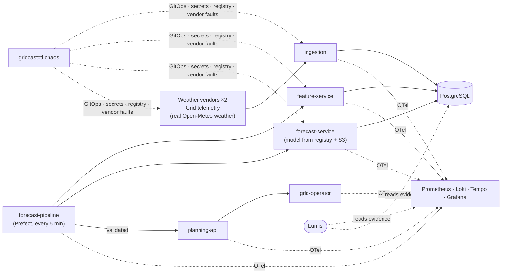

# GridCast — a reference estate for Lumis

GridCast is a small, production-shaped **energy-forecasting platform** that runs entirely on
your Mac. It ingests real weather (Open-Meteo) through simulated commercial vendors, reads
synthetic grid demand from a telemetry historian, builds features, serves a trained
probabilistic load model, validates every forecast and publishes day-ahead dispatch plans to
a synthetic grid operator — on Kubernetes (kind), orchestrated by Prefect, observed with
OpenTelemetry, Prometheus, Loki, Tempo and Grafana.

Its purpose is to be the **controlled world Lumis is tested in**: ten reproducible incidents
(bad releases, stale vendor data, credential rotation, OOM, model promotion, compound changes,
schema drift, silent unit changes, vendor outages, and a deterministic reference case) can be injected through realistic channels,
each with hidden ground truth for evaluation. GridCast knows nothing about Lumis.



## Quick start

Prerequisites: Docker Desktop (≥ 8 GB memory), [uv](https://docs.astral.sh/uv/),
[kind](https://kind.sigs.k8s.io/) and kubectl (`brew install uv kind kubectl`), internet for
the first run.

```bash
cd lumis-cookbooks/gridcast
make up        # cluster + platform + images + data + models + deploy (≈5–10 min first time)
make verify    # 12 end-to-end checks; all should PASS
make urls
```

`make up` = `cp .env.example .env` (if missing) + `uv sync --all-extras` + `uv run gridcastctl up`.

| Open | URL |
|---|---|
| Grafana (dashboards, logs, traces) | <http://localhost:3001> |
| Prefect (pipeline runs) | <http://localhost:4200> |
| pgAdmin (SQL, **ER diagram**) | <http://localhost:5050> |
| Prometheus (metrics, alerts) | <http://localhost:9090> |
| Planning API / Forecast / Feature service docs | <http://localhost:8080/docs> · <http://localhost:8081/docs> · <http://localhost:8082/docs> |
| SeaweedFS S3 admin / file browser / master | <http://localhost:23646> · <http://localhost:8888/buckets/> · <http://localhost:9333> |

## Try an incident

```bash
uv run gridcastctl chaos list
uv run gridcastctl chaos inject A     # feature-service 1.7.0: query amplification
uv run gridcastctl job pipeline       # don't wait 5 minutes for the next run
# investigate: Grafana, Prometheus, Loki, Tempo, Prefect, pgAdmin, `gridcastctl gitops log`
uv run gridcastctl chaos reveal       # ground truth
uv run gridcastctl chaos revert
```

| | Scenario | | Scenario |
|---|---|---|---|
| A | query amplification after a release | F | two releases, only one causal |
| B | vendor serves stale data with fresh timestamps | G | vendor schema break |
| C | DB credential rotated for one consumer only | H | vendor silently switches MW → kW |
| D | memory limit cut below working set (OOM) | I | weather vendor outage |
| E | model promotion slows inference 265× | J | planning-api left scaled to 0 (deterministic case) |

## What's inside

| Area | Highlights |
|---|---|
| Services | 6 estate services + 3 vendor simulators, FastAPI, pooled SQLAlchemy, probes, non-root read-only containers |
| Data | 6 schemas, comments on every column, least-privilege roles, Alembic migrations |
| ML | real ERA5 history (2 years) + simulated demand; quantile HistGradientBoosting (≈1.6 % MAPE) and a weather-scenario forest; registry with aliases and audit events; S3 artifacts |
| Orchestration | Prefect flow with retries and a publish/hold validation gate |
| Delivery | release catalogue with per-version behaviour flags, local registry, kustomize, local GitOps repo with authored commits and transactional apply |
| Observability | OTel SDK + Collector (OTLP, container logs, k8s events, kubelet, cAdvisor), Prometheus with SLO alerts, Loki, Tempo service graph, two Grafana dashboards, postgres-exporter + pg_stat_statements |
| Chaos | 9 scenarios, realistic channels, hidden ground truth, clean reverts |
| Tests | unit tests (incl. train/serve skew guard), `gridcastctl verify`, scripted drills |

## Documentation

| Doc | Contents |
|---|---|
| [docs/architecture.md](docs/architecture.md) | system context, topology, forecast cycle, features/model, releases & GitOps, security |
| [docs/infrastructure.md](docs/infrastructure.md) | kind + compose, networks, ports, k8s objects, images, config files, resource budget |
| [docs/data-model.md](docs/data-model.md) | ER diagram, schemas, roles, pgAdmin ERD how-to, useful SQL |
| [docs/observability.md](docs/observability.md) | signal flow, metric catalogue, alerts, dashboards, PromQL/LogQL/TraceQL cookbook |
| [docs/scenarios.md](docs/scenarios.md) | incident catalogue with causal diagrams, ground truth format, drill procedure |
| [docs/operations.md](docs/operations.md) | `gridcastctl` reference, common tasks, troubleshooting |
| [docs/testing.md](docs/testing.md) | test layers and the pre-push manual test plan |
| [docs/lumis-integration.md](docs/lumis-integration.md) | how Lumis connects: what it reads, incident lifecycle, deterministic triage, agent, how to run, reports, production intake, results |
| [lumis/README.md](lumis/README.md) | the `gridcast-lumis` harness: drills, benchmarks, experiments, reports |
| [lumis/experiments/README.md](lumis/experiments/README.md) | experiment protocol, systems, metric definitions, results layout |
| [docs/research-notes.md](docs/research-notes.md) | Experiment setup, results, caveats and what changed |

## Repository layout

```text
gridcast/
├── Makefile, pyproject.toml, uv.lock, .env.example
├── src/gridcast/
│   ├── services/        weather_vendor, grid_telemetry, ingestion, feature_service,
│   │                    forecast_service, planning_api, operator, common, vendor_faults
│   ├── pipeline/        Prefect flows (forecast-pipeline, train-model)
│   ├── features/        shared feature definitions + serving builders (hourly / minute)
│   ├── ml/              estimators, training, registry, S3 artifacts
│   ├── quality/         data-quality and validation checks
│   ├── weather/ demand/ simulation (Open-Meteo client, synthetic weather, demand model)
│   ├── db/              schema, Alembic migrations, reference data
│   ├── chaos/           scenario catalogue (A–J) + ground-truth store
│   ├── ctl/             gridcastctl (estate lifecycle, GitOps, verify, llm check)
│   └── cli.py           `gridcast` in-container entrypoint
├── deploy/
│   ├── releases.yaml    release catalogue (versions, flags, changelogs)
│   ├── docker/          runtime + release Dockerfiles
│   └── k8s/             kustomize: namespaces, platform bridges, vendors, estate, collector, job template
├── infra/               compose + Postgres, pgAdmin, SeaweedFS, Prometheus, Loki, Tempo, Grafana, kind
├── lumis/               Lumis integration (separate uv project): lumis.yaml, gridcast-lumis CLI
├── tests/
└── docs/
```

Runtime state (ignored by git): `.gridcast/gitops` (desired-state repo) and
`.gridcast/chaos/runs` (ground truth).

## Run Lumis against it

```bash
cd lumis && uv sync
uv run gridcast-lumis drill J            # deterministic diagnosis, ~0.3 s from alert to report
uv run gridcast-lumis drill A --use-agent
uv run gridcast-lumis report             # results/summary.md + charts
```

See [docs/lumis-integration.md](docs/lumis-integration.md).

## Everyday commands

```bash
make status | make verify | make test | make lint
uv run gridcastctl deploy feature-service 1.7.0 --reason "…"
uv run gridcastctl rollback feature-service
uv run gridcastctl config weather-provider wx-secondary
uv run gridcastctl model list
uv run gridcastctl llm check           # OpenRouter key + model (for Lumis)
make down                               # stop (keeps data)   ·   make purge  # delete everything
```
