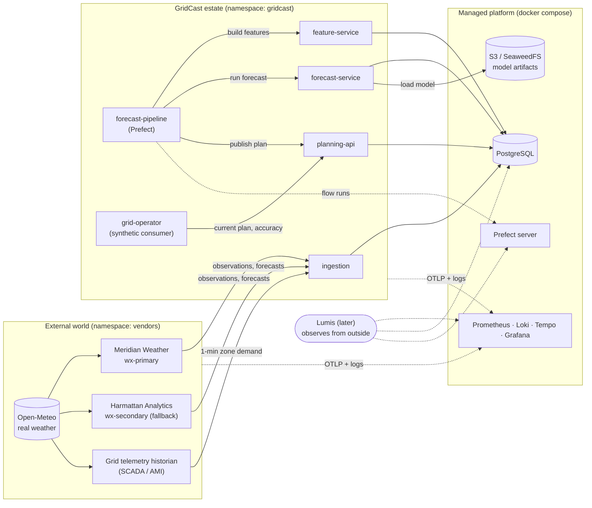
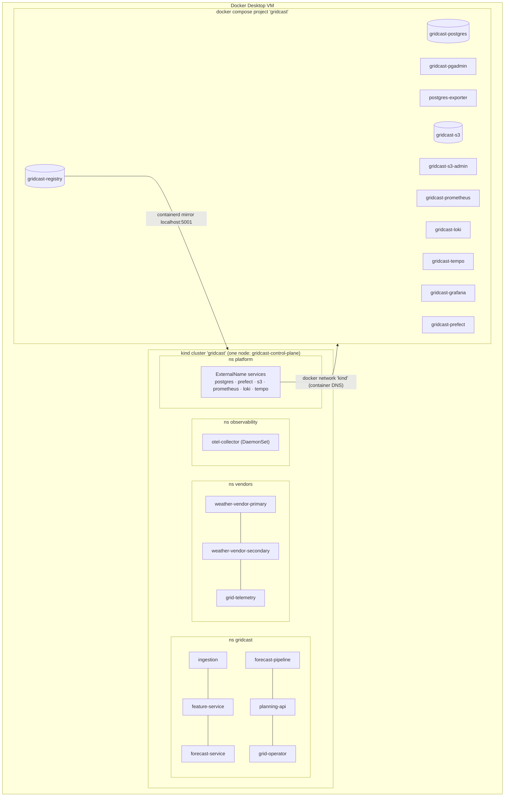
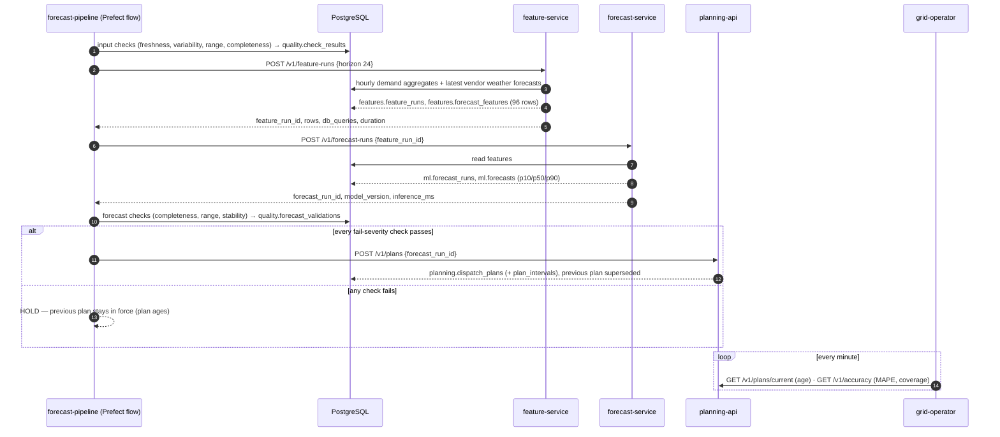
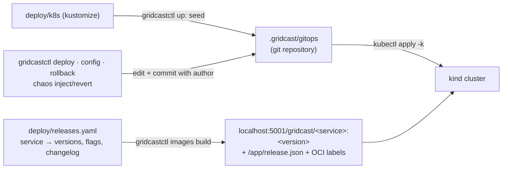

# GridCast architecture

GridCast is a small but complete energy-forecasting estate: it buys weather data from external
vendors, reads grid demand from a telemetry historian, builds features, runs a probabilistic
load-forecasting model, validates the result and publishes a day-ahead **dispatch plan** that a
(synthetic) grid operator consumes. It exists so Lumis has a realistic system to observe,
diagnose and, later, repair. GridCast knows nothing about Lumis; it only emits standard
telemetry.

## 1. System context

* **Vendors are external.** They run in the `vendors` namespace, are faulted only through their
  own admin APIs, and GridCast cannot fix them. That separation is the basis of several
  incident scenarios ("don't restart healthy services for a vendor problem").
* **Real weather, synthetic grid.** Vendors interpolate real Open-Meteo weather for four Ghanaian
  load zones (Accra, Kumasi, Tamale, Takoradi), adding vendor-specific measurement error and
  lead-time-dependent forecast error. Demand is generated from the *true* weather with a
  calendar/cooling/solar model, so when a weather vendor goes wrong, reality and GridCast's view
  of it genuinely diverge.
* **Managed services live outside the cluster**, as they would in a cloud estate (RDS, Prefect
  Cloud, S3, an observability SaaS). Pods reach them through `ExternalName` services in the
  `platform` namespace.

## 2. Deployment topology

| Layer | Technology | Why |
|---|---|---|
| Orchestration | kind (Kubernetes 1.34, single node) | Real Kubernetes API, rollouts, events, limits and OOM kills for diagnosis evidence |
| Managed services | Docker Compose on the shared `kind` network | Light on a 16 GB Mac; mirrors "managed services outside the cluster" |
| Images | Local registry `localhost:5001` | Fast pushes with layer dedup; containerd pulls through a mirror |
| Desired state | Kustomize + local GitOps repo (`.gridcast/gitops`) | Every change is a commit: real `git log`/`git diff` evidence and real reverts |
| Services | Python 3.12, FastAPI, SQLAlchemy 2, psycopg 3 | Production-style APIs with pooling, timeouts, probes |
| Workflow | Prefect 3 (server in compose, worker in cluster) | Flow/task states, retries and logs as orchestration evidence |
| ML | scikit-learn (HistGradientBoosting quantiles, RandomForest scenarios) | Real trained models on real historical weather |
| Data | PostgreSQL 17 + pg_stat_statements | Query-level evidence (calls, rows, time) |
| Artifacts | SeaweedFS (S3 API) | Model artifacts and cached training data |
| Telemetry | OpenTelemetry SDK + Collector → Prometheus, Loki, Tempo; Grafana | Vendor-neutral metrics, logs, traces and a trace-derived service graph |

## 3. The forecast cycle

Every `PIPELINE_INTERVAL_SECONDS` (default 300 s) the pipeline worker runs one Prefect flow:

Independently, **ingestion** pulls every 60 s (observations, demand) and every 15 min (weather
forecasts), and **forecast-service** polls the model registry every 30 s and hot-swaps the model
when the `production` alias moves.

## 4. Features and model

Forecasts are made at an hour-aligned cut-off `A` for target hours `T = A + k`, `k = 1..24`,
using only data before `A`:

| Feature | Definition |
|---|---|
| weather (6) | vendor forecast for `T` issued at or before `A` (persistence fallback) |
| calendar | hour, day-of-week, holiday flag of `T` |
| `load_lag_24h` | mean load of hour `T-24h` (or `T-48h` when `k = 24`) |
| `load_lag_168h` | mean load of hour `T-168h` |
| `load_mean_24h` / `load_recent_3h` | mean of hourly means over the 24 h / 3 h before `A` |
| `zone_idx`, `horizon_h` | categorical zone, lead time |

Load features and the target are normalised by zone base load, so one model serves all zones.
Training (`gridcast model train`) uses ~2 years of real ERA5 weather from the Open-Meteo archive,
simulates demand with the same model as the telemetry vendor, builds samples with a vectorised
copy of the serving feature code (a unit test guards against train/serve skew) and evaluates on
a 60-day time-based holdout.

| Profile | Algorithm | Holdout MAPE | p10–p90 coverage | Inference (96 rows) |
|---|---|---|---|---|
| `standard` (production) | 3 × HistGradientBoosting (quantile loss) | ~1.6 % | ~0.81 | ~30–100 ms |
| `hifi` (candidate) | RandomForest × 1,200 perturbed weather scenarios | ~1.6 % | ~0.88 | ~8 s |

The hifi model is genuinely better calibrated — a plausible reason for an ML engineer to
promote it — and ~100× slower to serve, which is what scenario E exploits.

## 5. Releases, GitOps and change history

* A release's behaviour is defined by **flags baked into its image** (e.g. feature-service
  1.7.0's `lag_resolution: minute`). The difference between versions is visible in the image,
  `GET /release`, the GitOps diff and the deployment's change-cause annotation.
* Every desired-state change is a commit with an author and a conventional message, applied
  transactionally (a rejected apply rolls the commit back). `git revert` is a real rollback.
* Out-of-band changes still happen, as in real life: secret rotations (Kubernetes Secret +
  `ALTER ROLE`), model-registry promotions (`ml.model_events`) and vendor behaviour.

## 6. Security posture (local, but done properly)

* Least-privilege database roles per workload (see [data-model.md](data-model.md)); migrations
  run as the schema owner; observers use a read-only role.
* Secrets come from `.env` into Kubernetes Secrets and are never committed to the GitOps repo.
* Containers run as non-root (uid 10001), read-only root filesystem, all capabilities dropped,
  `RuntimeDefault` seccomp; writable `/tmp` only.
* Vendor fault APIs require a token Lumis is never given.
