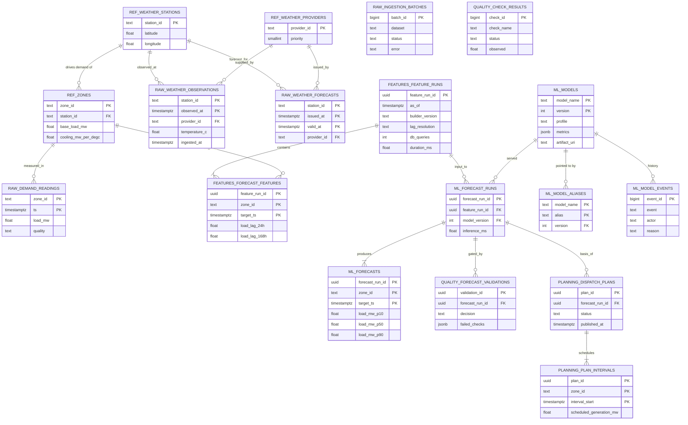
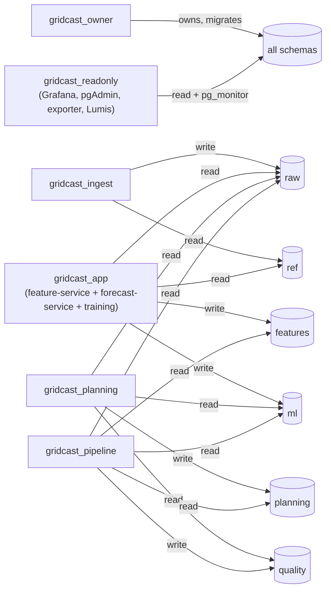

# Data model

One PostgreSQL 17 database (`gridcast`) with six schemas that follow the data's journey. Every
table and column has a `COMMENT`, so pgAdmin's ER diagram and Grafana's SQL editor are
self-documenting. Migrations live in `src/gridcast/db/migrations` (Alembic) and run as a
Kubernetes Job (`gridcastctl job migrate`).



## Schemas

| Schema | Holds | Written by |
|---|---|---|
| `ref` | zones, stations, vendors (from `src/gridcast/data/catalog.yaml`) | migrate job |
| `raw` | vendor data as ingested + ingestion audit (`ingestion_batches`) | ingestion |
| `features` | one `feature_runs` row per build, 96 `forecast_features` rows (4 zones × 24 h) | feature-service |
| `ml` | model registry (`models`, `model_aliases`, `model_events`), forecast runs, forecasts | training jobs, forecast-service |
| `quality` | every check result; publish/hold decisions | forecast-pipeline |
| `planning` | dispatch plans and per-zone hourly intervals | planning-api |

## Roles and least privilege



Roles are created on first boot by `infra/postgres/init/00-gridcast.sh` (passwords from
`.env`); grants and default privileges are applied by the first migration. `gridcast_app` is
deliberately **shared** by two services — that shared credential is what scenario C breaks.

## Viewing the database and its ER diagram (pgAdmin)

1. Open <http://localhost:5050> (desktop mode, no login needed).
2. Expand **Servers → GridCast → GridCast (owner – full ERD and DDL)**. The connection is
   pre-provisioned; the password comes from a passfile rendered at container start.
3. Right-click the **gridcast** database → **ERD For Database**. pgAdmin draws all six schemas
   with keys and relationships; you can rearrange, export as PNG/SQL, or right-click a single
   table → **ERD For Table**.
4. **Query Tool** on the read-only server is safe for exploration; the owner server can run DDL.

Other ways in: `gridcastctl psql` (read-only psql), the **GridCast — Data, models and decisions**
Grafana dashboard (SQL panels), or any client at `postgresql://gridcast_readonly@localhost:5432/gridcast`.

## Useful queries

```sql
-- Latest pipeline decisions
SELECT validated_at, decision, failed_checks, warnings
FROM quality.forecast_validations ORDER BY validated_at DESC LIMIT 10;

-- Feature builds: who built them and how expensive they were (scenario A shows up here)
SELECT created_at, builder_version, lag_resolution, db_queries, round(duration_ms) AS ms
FROM features.feature_runs ORDER BY created_at DESC LIMIT 10;

-- Model registry history (scenario E shows up here)
SELECT at, event, alias, version, previous_version, actor, reason
FROM ml.model_events ORDER BY at DESC;

-- Top statements by calls (query amplification evidence)
SELECT calls, rows, round(mean_exec_time::numeric, 2) AS mean_ms, left(query, 90)
FROM pg_stat_statements ORDER BY calls DESC LIMIT 10;

-- Published forecast vs actual for the last completed hour, per zone
WITH plan AS (SELECT forecast_run_id FROM planning.dispatch_plans
              WHERE published_at <= date_trunc('hour', now()) - interval '1 hour'
              ORDER BY published_at DESC LIMIT 1)
SELECT f.zone_id, f.load_mw_p50, avg(d.load_mw) AS actual_mw
FROM ml.forecasts f JOIN plan USING (forecast_run_id)
JOIN raw.demand_readings d ON d.zone_id = f.zone_id
     AND date_trunc('hour', d.ts) = f.target_ts
WHERE f.target_ts = date_trunc('hour', now()) - interval '1 hour'
GROUP BY f.zone_id, f.load_mw_p50;
-- (the planning API computes rolling MAPE/coverage: GET http://localhost:8080/v1/accuracy?hours=6)
```
