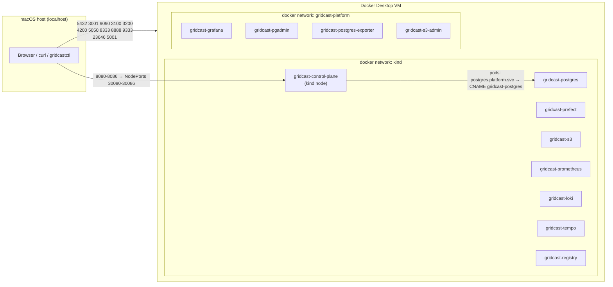
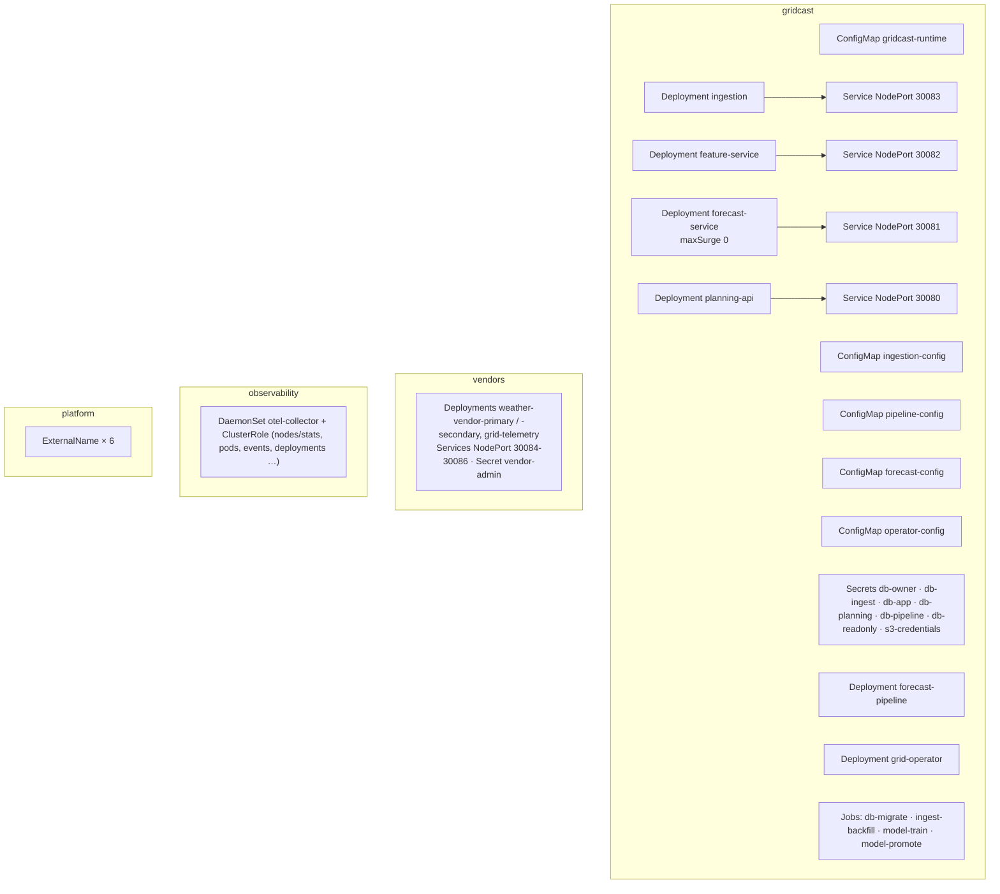

# Infrastructure

How the estate is assembled on a single Mac, what each piece does, and how they connect.

## Resource budget

Measured on an M-series Mac with Docker Desktop's default 8 GB VM:

| Component | Measured use | Limit | Notes |
|---|---|---|---|
| kind node incl. all pods | ~2.2 GB | node: VM | control plane, 6 estate pods, 3 vendors, collector |
| PostgreSQL | ~120 MB | 768 MB | |
| Tempo / Loki / Prometheus | ~320 / 165 / 125 MB | 768 / 512 / 768 MB | grows with retention (Prometheus 7 d, Loki 7 d, Tempo 72 h) |
| pgAdmin / Grafana / Prefect | ~240 / 160 / 125 MB | 512 / 384 / 768 MB | |
| SeaweedFS + admin, registry, exporter | ~210 MB | — | |
| **Total steady state** | **~3.7 GB** | | fits Docker Desktop's default 8 GB VM |
| Training jobs (transient) | up to ~2 GB | 3 GB | `standard` ~1 min, `hifi` ~2–3 min |

## Networks and names



* All compose services join **both** networks; the `kind` network is what lets pods resolve
  `gridcast-postgres` etc. through CoreDNS → Docker's embedded DNS.
* Pods never use container names directly: they use `ExternalName` services
  (`postgres.platform.svc.cluster.local`, `prefect.platform…`, `s3.platform…`,
  `prometheus.platform…`, `loki.platform…`, `tempo.platform…`). Swapping in a real managed
  service is a one-line change.
* Containerd on the kind node mirrors `localhost:5001` to `http://gridcast-registry:5000`
  (`/etc/containerd/certs.d/localhost:5001/hosts.toml`), so manifests reference
  `localhost:5001/gridcast/<service>:<version>` and pushes from the Mac land in the same place.

## Ports

| Port | What | Credentials |
|---|---|---|
| 8080 | planning-api (`/docs`) | — |
| 8081 | forecast-service (`/docs`) | — |
| 8082 | feature-service (`/docs`) | — |
| 8083 | ingestion (`/status`) | — |
| 8084 / 8085 | weather vendors primary / secondary | admin API needs `VENDOR_ADMIN_TOKEN` |
| 8086 | grid-telemetry vendor | admin API needs `VENDOR_ADMIN_TOKEN` |
| 3001 | Grafana | anonymous viewer; admin / `GRAFANA_ADMIN_PASSWORD` |
| 9090 | Prometheus | — |
| 3100 / 3200 | Loki / Tempo APIs | — |
| 4200 | Prefect UI + API | — |
| 5050 | pgAdmin (ER diagrams, SQL) | desktop mode, no login |
| 5432 | PostgreSQL | roles in `.env` |
| 8333 | S3 API (SeaweedFS) | `S3_ACCESS_KEY` / `S3_SECRET_KEY` |
| 23646 | SeaweedFS admin UI | admin / `S3_ADMIN_PASSWORD` |
| 8888 | SeaweedFS filer UI — browse `/buckets/gridcast-models/` | — |
| 9333 | SeaweedFS master UI — volumes and topology | — |
| 5001 | image registry | — |

Every platform port can be changed in `.env`.

## Kubernetes objects



Every workload has requests/limits, liveness/readiness/startup probes (except the pipeline
worker), downward-API identity (`K8S_POD_NAME`, `K8S_NAMESPACE`, `K8S_NODE_NAME`,
`K8S_DEPLOYMENT_NAME`), a non-root read-only security context and `imagePullPolicy: Always`
(the local registry is fast and tags may be rebuilt during development).

## GitOps repository

`gridcastctl up` copies `deploy/k8s` to `.gridcast/gitops`, pins image tags from
`deploy/releases.yaml` and commits it. From then on, **all** desired-state changes go through it:

```bash
uv run gridcastctl gitops log                 # who changed what, when
uv run gridcastctl gitops show <sha>          # full diff
uv run gridcastctl deploy feature-service 1.7.0 --reason "FEAT-412" --author "kofi <kofi@gridcast.dev>"
uv run gridcastctl rollback feature-service   # git revert of the last deploy commit
uv run gridcastctl config weather-provider wx-secondary
uv run gridcastctl config resources forecast-service --memory 1Gi
```

Apply is transactional: if `kubectl apply -k` rejects the result, the commit is reset. The repo
is ignored by the outer git repository.

## Images

| Image | Built from | Contents |
|---|---|---|
| `gridcast/runtime:base` | `deploy/docker/Dockerfile` | Python 3.12 + FastAPI/SQLAlchemy/OTel |
| `gridcast/runtime:ml` | same, `--extra ml` | + scikit-learn, pandas, boto3 |
| `gridcast/runtime:pipeline` | same, `--extra ml --extra pipeline` | + Prefect |
| `gridcast/<service>:<version>` | `deploy/docker/Dockerfile.release` | runtime + `/app/release.json` + OCI labels |

`deploy/releases.yaml` is the release catalogue: each service's versions, behaviour flags and
changelog. `gridcastctl images build [services…]` builds and pushes every release.

## Platform configuration files

| File | Purpose |
|---|---|
| `infra/compose.yaml` | all platform containers, limits, ports, volumes |
| `infra/postgres/init/00-gridcast.sh` | roles, databases (`gridcast`, `prefect`), `pg_stat_statements` |
| `infra/pgadmin/{servers.json,entrypoint.sh}` | pre-registered servers + passfile |
| `infra/seaweedfs/entrypoint.sh` | renders S3 identities from `.env`, starts SeaweedFS |
| `infra/prometheus/prometheus.yml` | OTLP receiver, scrape jobs |
| `infra/prometheus/rules/gridcast.yml` | recording rules + symptom alerts |
| `infra/loki/loki.yaml` | single-binary Loki, OTLP label promotion |
| `infra/tempo/tempo.yaml` | Tempo + metrics-generator (service graph, span metrics) |
| `infra/grafana/provisioning/**` | datasources (with trace↔log correlations) and dashboard provider |
| `infra/grafana/dashboards/*.json` | Estate overview; Data, models and decisions |
| `infra/kind/cluster.yaml` | node image, NodePort mappings, containerd registry config |
| `deploy/k8s/observability/otel-collector.yaml` | collector RBAC + pipelines |
