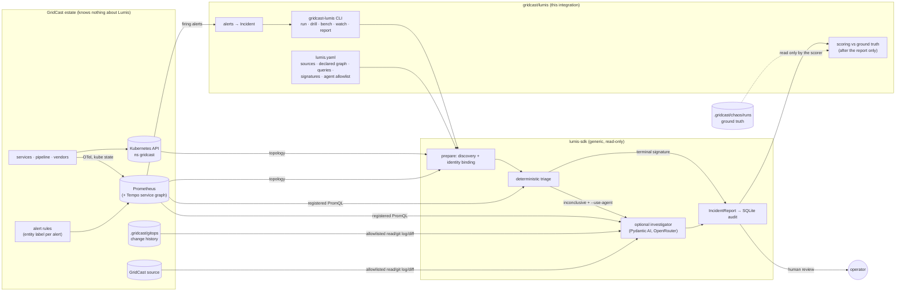
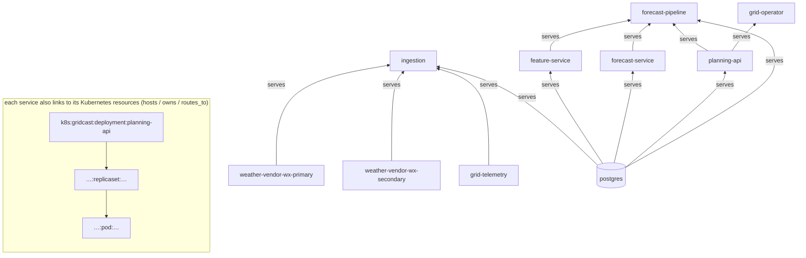
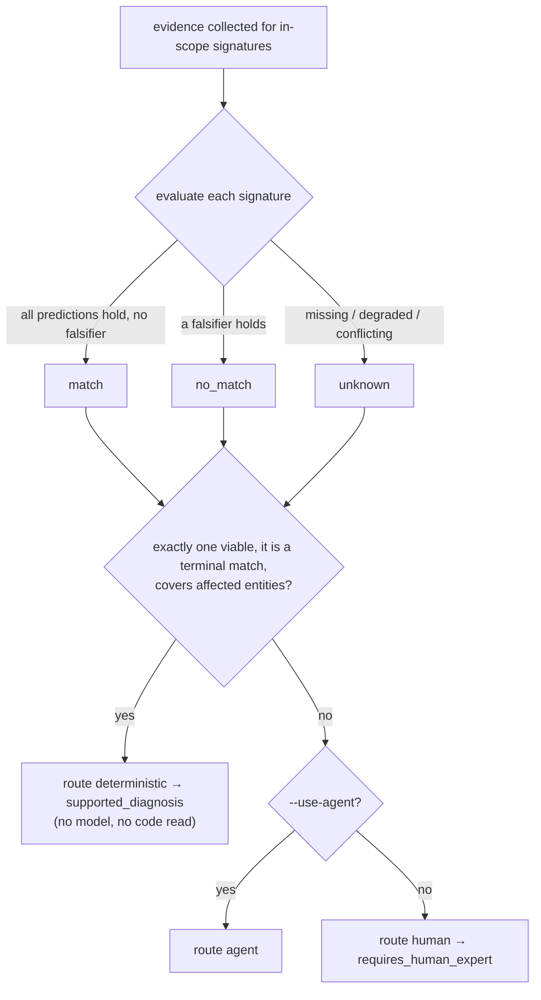
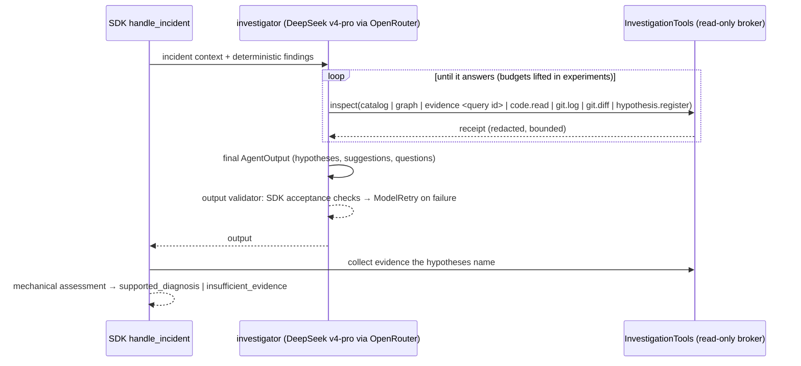
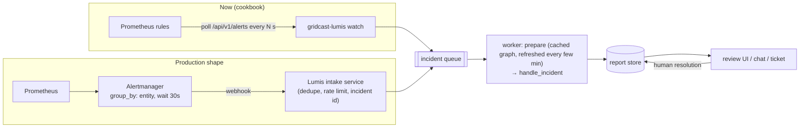

# Lumis × GridCast integration

> **Status (2026-10-04):** working against `lumis-sdk` `dev` (f42b8e8: PRs #105 and #106 add native
> SQL, typed change records and the agent fixes found here; `0.1.0rc1` metadata). The cookbook no
> longer carries SDK workarounds. The main experiment ran on c757a74 with temporary workarounds since
> merged into the SDK; the issues and fixes are recorded in the SDK's
> [integration lessons](https://github.com/soloshun/lumis-sdk/blob/dev/docs/design-notes/gridcast-integration-lessons.md). See [research-notes.md](research-notes.md).
> Code lives in [`gridcast/lumis/`](../lumis/).

## 1. Who does what



* **GridCast** emits standard signals and labels each alert with the graph entity where the
  symptom is seen. That is its only accommodation, and it is an ordinary practice (alert routing
  labels).
* **The integration** (`gridcast/lumis`) holds everything GridCast-specific: the Lumis project
  file, alert intake, scenario drills, scoring and benchmarks.
* **The SDK** holds only generic machinery and never imports GridCast. It is read-only by
  construction: it reports and suggests; it cannot act.

## 2. What Lumis looks at (and what it never sees)

| Input | Where it comes from | Used for |
|---|---|---|
| Declared topology | `lumis.yaml → graph` (owners, criticality, vendors, DB, `serves` edges) | knowledge discovery can't infer (externals, idle dependencies) |
| Kubernetes topology | `kubectl get services,deployments,pods,replicasets -n gridcast` (read-only) | resources, ownership, `service:gridcast:<app label>` identities |
| Call topology | `traces_service_graph_request_total` (Tempo metrics-generator) | observed service → service and service → database edges |
| Evidence: metrics | 16 PromQL instant queries at the incident end time | most signature predictions/falsifiers |
| Evidence: logs | 5 Loki queries (3 counts, 2 message lists) over the incident window | credential, contract, vendor-503 support; messages for the agent |
| Evidence: traces | 1 Tempo TraceQL query (slow pipeline trace durations) | agent context |
| Evidence: orchestration | 2 Prefect queries (failed run count, run list) for `forecast-pipeline` | collected on every incident |
| Evidence: SQL *(temporary)* | `ml.model_events` production-alias moves, via the harness and the SDK `snapshot` provider | E until the SDK has a SQL provider |
| Change history (agent) | read-only `git log`/`git diff` on `.gridcast/gitops` (approved files) | recent deploys / config / limit changes |
| Source (agent) | 7 allowlisted GridCast files (features, services, quality, releases) | reading code paths a hypothesis implicates |
| **Never** | chaos ground truth, `.env` (except the model key, read by the harness), Secrets, vendor admin tokens | — |

The prepared graph on the live estate: **47 entities, 68 relationships** (10 declared,
43 from Kubernetes, 9 from the service graph; the DB node `gridcast` is aliased to
`service:gridcast:postgres`). Render it with `gridcast-lumis graph` (SVG) or
`--format terminal`.



## 3. One incident, end to end

```mermaid
sequenceDiagram
    autonumber
    participant P as Prometheus
    participant H as gridcast-lumis
    participant S as Lumis SDK
    participant K as Kubernetes API
    participant M as Model (optional)
    participant DB as runs/ + SQLite
    P->>H: firing alerts {alertname, entity, activeAt}
    H->>H: Incident(affected = entity labels, window = first alert − 30 min … now)
    H->>S: YamlProject.prepare(at = incident end)
    S->>K: list services/deployments/pods/replicasets (ns gridcast)
    S->>P: service-graph vector
    S-->>H: prepared graph (declared ⊕ discovered, aliases bound)
    H->>S: prepared.handle_incident(incident, use_agent?)
    S->>S: scope graph (3 hops) · select in-scope signatures
    S->>P: registered PromQL for every in-scope signature (≤ 40 queries)
    S->>S: evaluate signatures → match / no_match / unknown
    alt exactly one terminal match, covers all affected, others contradicted
        S-->>H: report(route=deterministic, supported_diagnosis)
    else inconclusive and --use-agent
        S->>M: findings + catalog; agent calls inspect(catalog/graph/evidence/code/git)
        M-->>S: candidate hypotheses (+ suggestions)
        S->>P: evidence the candidates name
        S-->>H: report(route=agent, mechanically assessed)
    else inconclusive
        S-->>H: report(route=human, requires_human_expert, findings attached)
    end
    H->>DB: incident.json · report.json · run.json · incidents.sqlite
    Note over H: drills only: read ground truth now, score, revert
```

### Logs, traces and orchestration

Loki, Tempo and Prefect are native SDK connectors (`sources.loki|tempo|prefect`, providers
`loki|tempo|prefect`). Their semantics shape the signatures:

* Loki counts cover the **whole incident window**; zero matches produce **no fact** (absence is
  not proof), and a result at `max_results` is `degraded`. So log counts may only *support* a
  signature; each signature that uses one is also falsifiable by a Prometheus observable, so a
  healthy estate still contradicts it (otherwise J could never be concluded).
* Prefect `failed_count` is a real number (0 included) for runs started inside the window.
* Tempo `duration_ms` returns sampled matching traces, not percentiles; it is agent context.

| Query | Provider | Observable |
|---|---|---|
| `feature-auth-failures` | loki (count) | feature-service `password authentication failed` lines |
| `ingestion-contract-violations` | loki (count) | ingestion `ContractViolation` lines |
| `ingestion-weather-vendor-503` | loki (count) | ingestion `HTTP 503 from weather-primary` lines |
| `feature-service-error-log`, `ingestion-error-log` | loki (entries) | redacted error messages for the agent |
| `slow-pipeline-traces` | tempo (duration_ms) | forecast-pipeline traces slower than 3 s |
| `prefect-failed-flow-runs`, `prefect-flow-runs` | prefect | failed count / run list (initial query) |
| `model-production-alias-changes` | sql (native) | `ml.model_events` alias moves, 30 min |
| `<service>-changes-60m` (×5) | changes (native) | GitOps commits (by path and conventional-commit scope) and rollouts in the last hour |

**SQL and change records** are native SDK providers. SQL runs as `gridcast_readonly` in a
read-only transaction with a 5 s timeout; the DSN is set in the environment by `runner.py`.
Change records come from the GitOps repository and Kubernetes ReplicaSets, and the agent also
reads them through `inspect(changes)`.

## 4. Deterministic triage

Signatures are falsifiable hypotheses (predictions + falsifiers over registered observations).
A run ends deterministically only when **exactly one** in-scope signature matches, it is marked
`terminal`, predicts ≥ 2 distinct observables, explains every affected entity, and every other
in-scope signature is contradicted. Anything else escalates with the findings attached.



| Signature | Terminal | Predicts | Falsified by | Scenario |
|---|---|---|---|---|
| `planning-api-scaled-to-zero` | **yes** | desired = 0, available = 0, operator transport errors > 0 | desired > 0 | J |
| `feature-query-amplification` | no | SQL/build > 100, build p95 > 1 s | SQL/build ≤ 20 | A, F |
| `feature-builds-failing` | no | failed builds > 0 | failed builds = 0 | C (symptom) |
| `feature-service-db-auth-failing` | no | failed builds > 0, auth-failure log lines > 0 *(Loki)* | failed builds = 0 | C |
| `forecast-service-oom-killed` | no | OOM kills > 0, restarts > 0 | OOM kills = 0 | D |
| `forecast-model-slowdown` | no | inference p95 > 2 s, model reloads > 0, production alias moved *(SQL)* | p95 < 1 s or restarts > 0 | E |
| `demand-feed-rejected` | no | demand batch errors > 0, contract-violation log lines *(Loki)* > 0, weather errors = 0 | demand errors = 0 | G |
| `demand-values-out-of-range` | no | range failures > 0, demand errors = 0 | range failures = 0 | H |
| `weather-feed-failing` | no | weather batch errors > 0, vendor-503 log lines *(Loki)* > 0 | weather errors = 0 | I |
| `weather-feed-repeating` | no | variability warnings > 0, weather errors = 0 | warnings = 0 | B |

Why only J is terminal: its observables establish the cause (an operator set desired = 0). The
others establish *what* is happening, not *why*: an OOM kill does not say whether the limit, a
leak or a spike caused it; failing builds do not say why they fail (C needs logs).

### The agent path (when triage is inconclusive)

`--use-agent` runs the SDK's own Pydantic AI investigator (`models` in `lumis.yaml`, reasoning
effort high). The fixes for the issues found in the first live runs (OpenRouter routing with
DeepSeek, zero retries, all-or-nothing output acceptance) are in the SDK now. Experiments inject a
thin subclass (`src/gridcast_lumis/investigator.py`) that only lifts pydantic-ai's caps and turns
on cost accounting. The issues and their SDK fixes are recorded in the SDK's
[integration lessons](https://github.com/soloshun/lumis-sdk/blob/dev/docs/design-notes/gridcast-integration-lessons.md).



Example (scenario A, `deepseek-v4-pro-0813`): 9 requests, 22 evidence queries, 288k/23k tokens,
$0.14, 4.7 min, 58k characters of reasoning → `supported_diagnosis`: *feature-service 1.7.0's
`lag_resolution=minute` builder issues ~2,500 SQL statements per build with a non-sargable
`date_trunc` predicate*; suggestion: keep 1.6.0 pinned until the builder is fixed.

## 5. Scenario coverage today

| | Expected path now | Lead from triage | Evidence the agent adds | Missing adapters |
|---|---|---|---|---|
| **J** scaled to zero | deterministic diagnosis | full | — | — |
| A query amplification | human / agent | `feature-query-amplification` | gitops diff 1.6.0 → 1.7.0, `features/store.py` | — |
| B stale vendor data | human / agent | `weather-feed-repeating` (after ~30 min) | — | SQL (raw values) |
| C credential rotation | human / agent | `feature-service-db-auth-failing` | error log messages | Secret/rotation metadata |
| D memory limit | human / agent | `forecast-service-oom-killed` | gitops diff (limit 1Gi → 160Mi) | — |
| E model promotion | human / agent | `forecast-model-slowdown` | — | SQL provider (shim today) |
| F compound change | human / agent | `feature-query-amplification` | gitops log: two deploys, one relevant | — |
| G schema break | human (abstain ok) | `demand-feed-rejected` | error log messages, `ingestion.py` | — |
| H unit change | human (abstain ok) | `demand-values-out-of-range` | — | SQL |
| I vendor outage | human / agent | `weather-feed-failing` | error log messages | — |

## 6. Experiments (for the paper)

`uv run gridcast-lumis experiment` runs the rule tier, a single-pass LLM and full Lumis on the
**same frozen incident** for each injected scenario, with repeats, and writes everything (raw
reports, transcripts with reasoning, receipts, ground truth, metrics, charts) to
`lumis/experiments/<name>/`. Protocol and metric definitions (mapped to the SEAMS research-plan
metric families): [lumis/experiments/README.md](../lumis/experiments/README.md).

## 7. How to run it

```bash
cd lumis-cookbooks/gridcast/lumis
uv sync                                      # installs lumis-sdk (editable, ../../../lumis-sdk)
uv run lumis doctor   --project lumis.yaml   # schema + local readiness (no network)
uv run lumis discover --project lumis.yaml --report   # live discovery, per-source status
uv run gridcast-lumis graph                  # results/graph-estate-<ts>.svg
uv run gridcast-lumis alerts                 # what is firing, with entity labels

uv run gridcast-lumis drill J                # inject → alert → Lumis → score → revert
uv run gridcast-lumis drill A                # deterministic lead, escalates to human
uv run gridcast-lumis drill A --use-agent    # same, with the OpenRouter investigator
uv run gridcast-lumis bench --iterations 50  # time the deterministic path (needs a firing incident)
uv run gridcast-lumis report                 # results/summary.md + PNG charts

uv run gridcast-lumis run [--use-agent] [--entity service:gridcast:X]   # one-off, no scoring
uv run gridcast-lumis watch --interval 30    # production-style loop (below)
uv run pytest                                # offline signature tests (no cluster)
```

`--use-agent` reads `OPENROUTER_API_KEY` from `gridcast/.env` (never printed) and uses
`models.model` in `lumis.yaml` (default `deepseek/deepseek-v4-flash`, ≈ $0.00002 per small call).

### What you get

| Output | Contents |
|---|---|
| terminal | route, conclusion, stop reason, timings, signature table, supported hypotheses, suggestions, score |
| `runs/<incident>/incident.json` | the exact Incident Lumis received |
| `runs/<incident>/report.json` | full `IncidentReport`: context, evidence, findings, assessments, tool receipts, suggestions, metrics |
| `runs/<incident>/run.json` | timings (prepare / handle) and discovery status |
| `runs/incidents.sqlite` | SDK `IncidentStore` audit; add human resolutions with `uv run lumis record-resolution --store runs/incidents.sqlite --resolution r.json --confirm` |
| `results/drills.jsonl`, `results/bench.jsonl` | one line per drill / benchmark |
| `results/summary.md`, `results/*.png` | tables + charts: time to report, outcomes, deterministic latency |

## 8. From manual trigger to production intake

Today an incident is opened by a command (`run`, `drill`) or by the polling loop (`watch`).
In production the same intake becomes event-driven:



* **Debounce, not stream.** Alerts are grouped per entity set with a cooldown so one outage is
  one incident; a re-fire after the cooldown opens a new incident ID (IDs are immutable in the store).
* **Graph caching.** Discovery is ~0.3 s here but costs more on large estates; a worker can keep
  a `PreparedProject` and refresh it periodically (`bench --reuse-prepared` measures that mode).
* **Authority stays human.** Reports are proposals; resolutions are recorded by people.

## 9. Lessons from the first live runs

* **Window boundaries must be exact.** Prometheus echoes the query time rounded to milliseconds.
  With a microsecond incident end, the echo can land *after* the window, and the SDK rightly
  rejects every observation (two early drills had zero evidence and escalated). The harness now
  truncates incident times to whole seconds. *SDK suggestion:* let `PrometheusConnector` record
  `observed_at = min(returned, incident.ended_at)` or truncate the query time.
* **Group before opening.** The first alert can fire before slower evidence (consumer polls,
  15-s Kubernetes metric scrapes) exists. Drills and `watch` wait 60 s after the first alert
  (Alertmanager `group_wait`) and only use alerts that became active after the injection.
* **Initialize counters.** Label sets that appear only during incidents (`status="failed"`)
  start at 1, so `increase()` misses the first failure; GridCast now exports them at 0.
* **Missing ≠ healthy.** An unreadable source leaves a signature `unknown`, which blocks a
  deterministic conclusion — by design. Because Loki returns no fact for zero matches, log
  counts are used only as supporting predictions, never as falsifiers.

## 10. What belongs in the SDK vs. here

| Keep in the cookbook (GridCast-specific) | Propose for the SDK (generic) |
|---|---|
| `lumis.yaml`: queries, signatures, declared graph, allowlists | Alertmanager-webhook / Prometheus-alerts **incident intake** adapter |
| alert `entity` labels and thresholds | a **watch/worker** loop with debounce + cached `PreparedProject` |
| scenario drills, ground-truth scoring, benchmark charts | a **SQL** evidence provider (E registry evidence; B/H raw values) |
| fault injection (`gridcastctl chaos`) | typed **recent-change** queries from a GitOps repo (#99) |
| | a benchmark/report **result schema** shared by all cookbooks |

## 11. Results so far

Measured on this laptop estate (kind + compose, 21 days of history):

| Run | Route | Conclusion | Score | Prepare | Evidence + triage | Queries | Model calls |
|---|---|---|---|---|---|---|---|
| healthy control (`run --entity grid-operator`) | human | requires_human_expert | — (no incident) | 0.31 s | 138 ms | 19 | 0 |
| **J** drill | **deterministic** | **supported_diagnosis** | **correct_diagnosis** | 0.24 s | 137 ms | 19 | 0 |

Deterministic-path benchmark on J (native connectors, 19 evidence queries per run, every run
`supported_diagnosis`): **50 runs with fresh discovery**: evidence + triage p50 58 ms / p95 106 ms,
end to end p50 0.14 s / p95 0.20 s; **200 runs on a cached graph**: p50 56 ms / p95 70 ms,
end to end p50 0.06 s / p95 0.08 s (`lumis/results/bench.jsonl`).

The controlled comparison (rule tier vs. single-pass LLM vs. Lumis with a reasoning model, all ten
scenarios, raw transcripts and reasoning traces) is in
`lumis/experiments/2026-10-03-main-deepseek-v4-pro/` — see its `summary.md` and `metrics.json`.

Benchmarks and further drills are appended to `gridcast/lumis/results/` by the commands above;
`gridcast-lumis report` regenerates the tables and charts.
