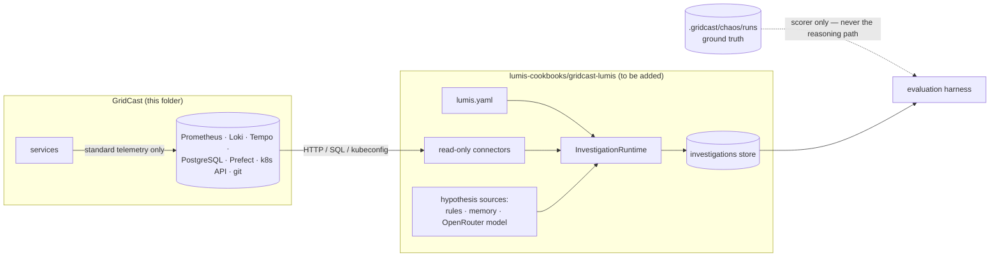
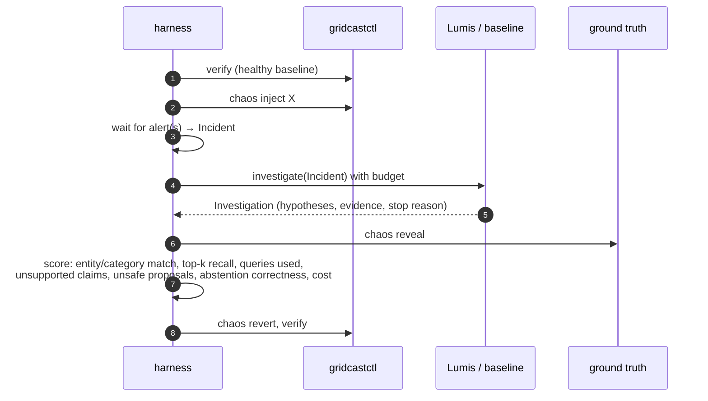

# Lumis integration (planned)

> **Status:** GridCast (the estate, its telemetry and the incident catalogue) is complete. The
> Lumis side is waiting for the SDK refactor ("LLM proposes, Lumis proves",
> `new_design_pattern.md`) to land; this page records how the two will connect so the
> integration is mechanical once it does. Nothing in GridCast imports Lumis, and Lumis must
> never import GridCast code.

## Separation rule



## Mapping onto the new SDK contracts

The refactor (worktree `lumis-sdk-operational-intelligence`) introduces `lumis_sdk.core`
(`Entity`, `Relationship`, `GraphSnapshot`, `Incident`, `EvidenceQuery`, `Evidence`, `Check`,
`Hypothesis`, `IncidentContext`, `InvestigationBudget`, `Investigation`), `lumis_sdk.graph.OperationalGraph`,
`lumis_sdk.reasoning` (`RuleSource`, `MemoryHypothesisSource`, `ModelHypothesisSource`,
`assess`) and `lumis_sdk.runtime` (`EvidenceConnector`, `InvestigationRuntime`,
`InvestigationStore`).

| SDK concept | GridCast source |
|---|---|
| `Entity` / `Relationship` (discovered) | k8s API (Deployments, Pods, Services, ConfigMaps, Secrets), Tempo service graph (`traces_service_graph_request_total{client,server}`), Prefect flow/task names, `ref.*` tables |
| `Entity` / `Relationship` (declared) | `lumis.yaml`: criticality, owners, allowed/forbidden actions, vendors as external |
| `EvidenceConnector` (read-only) | Prometheus HTTP API, Loki API, Tempo API, PostgreSQL (`gridcast_readonly`), k8s API, GitOps repo (`git log/diff`), Prefect API, `ml.model_events` |
| `Incident` | Prometheus alerts (`/api/v1/alerts`) → affected entities + symptom text + window |
| `RuleSource` | known patterns: OOMKilled → memory limit; ContractViolation → vendor schema drift; auth failed → credential |
| `MemoryHypothesisSource` | previous `Investigation`s (re-tested, never trusted) |
| `ModelHypothesisSource` | OpenRouter (`OPENROUTER_MODEL`, default `deepseek/deepseek-v4-flash`), structured output |
| `Check` | e.g. `(deployment:gridcast/feature-service, db_queries_per_build) gt 100` |

### Entity ids (match the ground-truth `root_cause_entity`)

`deployment:gridcast/<name>` · `pod:gridcast/<name>` · `vendor:wx-primary|wx-secondary|grid-telemetry`
· `database:gridcast-postgres` · `model:gridcast-load@production` · `flow:forecast-pipeline` ·
`secret:gridcast/db-app` · `change:gitops/<sha>`.

### Draft `lumis.yaml`

```yaml
project: { name: gridcast, environment: local }
sources:
  kubernetes: { context: kind-gridcast, namespaces: [gridcast, vendors] }
  prometheus: { endpoint: http://localhost:9090 }
  loki: { endpoint: http://localhost:3100 }
  tempo: { endpoint: http://localhost:3200 }
  prefect: { endpoint: http://localhost:4200/api }
  postgres: { dsn: postgresql://gridcast_readonly@localhost:5432/gridcast }
  git: { repository: ../gridcast/.gridcast/gitops }
models:
  default: { provider: openrouter, model: ${OPENROUTER_MODEL} }
policies:
  default_action_mode: approval_required
entities:
  planning-api: { criticality: critical, objectives: { max_plan_age: 15m } }
  vendors: { external: true, allowed_actions: [], forbidden_actions: [restart, rollback] }
deny_paths: [../gridcast/.gridcast/chaos]   # ground truth is never evidence
```

### First evidence-query catalogue (one per discriminating fact)

| Query id | Provider | Entity | Key |
|---|---|---|---|
| `fs-queries-per-build` | prometheus | deployment:gridcast/feature-service | `db_queries_per_build` |
| `fs-build-p95` | prometheus | deployment:gridcast/feature-service | `build_p95_seconds` |
| `inference-p95` | prometheus | deployment:gridcast/forecast-service | `inference_p95_seconds` |
| `fc-oom-kills` | prometheus | deployment:gridcast/forecast-service | `oom_events_15m` |
| `fc-restarts` | kubernetes | deployment:gridcast/forecast-service | `restarts_15m` |
| `pg-scan-rate` | prometheus | database:gridcast-postgres | `rows_scanned_per_s` |
| `recent-deploys` | git | deployment:* | `deployed_within_30m` |
| `model-alias-moved` | postgres | model:gridcast-load@production | `alias_changed_within_30m` |
| `auth-failures` | loki | deployment:gridcast/feature-service | `auth_failures_10m` |
| `secret-newer-than-pod` | kubernetes | deployment:gridcast/feature-service | `secret_newer_than_pod` |
| `wx-variability` | postgres | vendor:wx-primary | `distinct_obs_60m` |
| `ingest-contract-errors` | postgres | vendor:grid-telemetry | `contract_violations_10m` |
| `vendor-5xx` | loki | vendor:wx-primary | `http_503_10m` |

## Evaluation harness (to build with the integration)



Systems compared (per the research plan): rule baseline; single-pass LLM over a static evidence
bundle; tool-using LLM without hypothesis state; Lumis with explicit hypotheses and active
evidence acquisition. Results go to a JSONL file per run plus a summary table for the SEAMS
write-up.

## Verifying the LLM wiring now

```bash
uv run gridcastctl llm check
```

Sends one tiny structured-output request using `OPENROUTER_API_KEY` and `OPENROUTER_MODEL` from
`.env` and prints latency, tokens and cost. Measured 2026-10-03: `deepseek/deepseek-v4-flash`
≈ $0.00002 per check; `google/gemini-2.5-flash-lite` fastest (~1.6 s);
`openai/gpt-oss-20b` produced malformed structured output and is not recommended.
