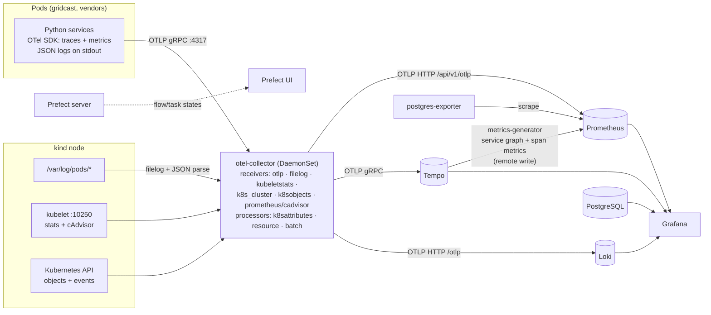

# Observability

GridCast emits the signals a well-run production estate would — nothing Lumis-specific. These
are the evidence sources Lumis will read.



## Signals

| Signal | Source | Where | Examples |
|---|---|---|---|
| Application metrics | OTel SDK in every service | Prometheus | `gridcast_pipeline_run_duration_seconds`, `gridcast_feature_db_queries_total`, `gridcast_inference_duration_seconds{model_version}` |
| HTTP metrics | FastAPI/httpx auto-instrumentation | Prometheus | `http_server_duration_milliseconds{service_name,http_target,http_status_code}` |
| Kubernetes state | `k8s_cluster` receiver | Prometheus | `k8s_container_restarts`, `k8s_deployment_available`, `k8s_container_memory_limit_bytes` |
| Resource usage | `kubeletstats` + cAdvisor | Prometheus | `k8s_container_cpu_limit_utilization_ratio`, `container_cpu_cfs_throttled_periods_total`, `container_oom_events_total` |
| Database | postgres-exporter, `pg_stat_statements` | Prometheus + SQL | `pg_stat_statements_calls_total`, `pg_stat_database_tup_returned`, `pg_stat_activity_count` |
| Call topology | Tempo metrics-generator | Prometheus | `traces_service_graph_request_total{client,server}` |
| Traces | OTel SDK | Tempo | pipeline → feature-service → PostgreSQL spans, with `prefect.flow_run_id` |
| Logs | container stdout (JSON) | Loki | `{service_name="feature-service"}`, structured fields + `trace_id` |
| Kubernetes events | `k8sobjects` receiver | Loki | Scheduled, Pulled, OOMKilled, BackOff, ScalingReplicaSet |
| Orchestration | Prefect | Prefect API/UI | flow-run and task-run states, retries, logs |
| Change history | GitOps repo, `ml.model_events`, Secret annotations | git / SQL / k8s API | deploys, config/limit changes, promotions, rotations |
| Business outcomes | grid-operator, planning-api | Prometheus, SQL | `gridcast_consumer_plan_age_seconds`, `gridcast_consumer_forecast_mape_ratio` |

Resource attributes follow OpenTelemetry semantic conventions (`service.name`,
`service.version`, `k8s.namespace.name`, `k8s.pod.name`, `k8s.deployment.name`,
`deployment.environment.name`) and are promoted to Prometheus labels and Loki index labels, so
every signal can be joined on the same identity.

## Metric catalogue (GridCast-specific)

| Metric | Type | Labels | Meaning |
|---|---|---|---|
| `gridcast_pipeline_runs_total` | counter | `status` = published / held / failed | pipeline outcomes |
| `gridcast_pipeline_run_duration_seconds` | histogram | `status` | end-to-end run time |
| `gridcast_pipeline_stage_duration_seconds` | histogram | `stage`, `status` | check_inputs, build_features, run_forecast, validate, publish |
| `gridcast_feature_build_duration_seconds` | histogram | `lag_resolution`, `status` | feature build time |
| `gridcast_feature_db_queries_total` | counter | `lag_resolution` | SQL statements issued by feature builds |
| `gridcast_feature_builds_total` | counter | `lag_resolution`, `status` | |
| `gridcast_inference_duration_seconds` | histogram | `model_version`, `profile` | model inference per forecast run |
| `gridcast_model_loads_total` | counter | `model_version`, `profile` | registry hot-reloads |
| `gridcast_forecast_runs_total` | counter | `model_version`, `profile`, `status` | |
| `gridcast_plans_published_total` | counter | | |
| `gridcast_ingest_batches_total` | counter | `dataset`, `source`, `status` | ingestion cycles |
| `gridcast_ingest_rows_total` | counter | `dataset`, `source` | rows upserted |
| `gridcast_data_freshness_seconds` | gauge | `dataset` | age of newest stored record |
| `gridcast_quality_checks_total` | counter | `check`, `status` | quality check outcomes |
| `gridcast_consumer_plan_age_seconds` | gauge | | age of the plan operators use (SLO) |
| `gridcast_consumer_forecast_mape_ratio` | gauge | | rolling 6 h realized MAPE (SLO) |
| `gridcast_consumer_coverage_ratio` | gauge | | realized p10–p90 coverage |
| `gridcast_consumer_requests_total` | counter | `endpoint`, `status`, `outcome` = ok / http_error / transport_error | planning-api calls by the operator |

## Alerts (symptoms, never causes)

Defined in `infra/prometheus/rules/gridcast.yml`, visible at <http://localhost:9090/alerts>.
Every alert carries an **`entity` label**: the canonical graph ID (`service:gridcast:<name>`) of
the component where the symptom is observed. The Lumis integration turns firing alerts into an
incident's affected entities from this label alone.

| Alert | Fires when | Typical scenarios |
|---|---|---|
| `PlanningApiUnreachable` (page) | operator plan reads fail to connect | J |
| `ForecastPlanStale` (page) | plan in use older than 15 min | C, D, G, H, I, J |
| `ForecastPipelineFailing` (page) | ≥ 2 held/failed runs in 15 min | C, D, G, H |
| `ForecastPipelineSlow` | pipeline p95 > 5 s | A, E, F |
| `FeatureBuildSlow` | feature build p95 > 2 s | A, F |
| `InferenceSlow` | inference p95 > 2 s | E |
| `DatabaseScanSurge` | rows scanned/s > 50 k | A, F |
| `PodCrashLooping` (page) | > 2 restarts in 10 min | D |
| `DeploymentReplicasUnavailable` | available < desired for 3 min | D |
| `InputDataStale` | a dataset not advancing for 10 min | G, I |
| `IngestionErrors` | > 3 failed batches in 10 min | G, I |
| `DataQualityWarnings` | a warn-level check repeating | B, O |
| `ForecastShiftedVsPlan` | one forecast deviated > 10% from the published plan (a single breach: later runs compare against the shifted plan and pass) | N |
| `ForecastAccuracyDegraded` | rolling MAPE > 8 % for 10 min | B (slowly) |
| `ServiceErrorRate` | 5xx ratio > 5 % | C |

Counters with known label sets (pipeline outcomes, build statuses, ingestion batches, quality
checks, operator outcomes) are exported at 0 on start-up, so the first failure is visible to
`increase()`.

Thresholds are calibrated to the healthy estate (pipeline ≈ 1 s, feature build ≈ 0.06 s,
inference ≈ 0.1 s).

## Dashboards (Grafana, <http://localhost:3001>)

* **GridCast — Estate overview** (home): business SLO tiles, pipeline duration/outcomes/stages,
  feature build cost, inference by model version, HTTP latency and errors, data freshness,
  ingestion, quality checks, PostgreSQL load, Kubernetes CPU/memory/throttling/restarts,
  warning/error logs. Model-registry changes are drawn as annotations.
* **GridCast — Data, models and decisions**: published forecast (p10/p50/p90) vs actual load,
  model registry and its events, validation decisions, feature builds, ingestion batches,
  forecast runs — straight from PostgreSQL.
* **Explore → Tempo → Service graph**: the call topology derived purely from traces.
* Logs ↔ traces are linked both ways (`trace_id` in every log line; "Logs for this span" in
  Tempo).

## Query cookbook

```promql
# Feature build cost per build (A/F: ~4 → ~2,500)
sum(rate(gridcast_feature_db_queries_total[10m])) / sum(rate(gridcast_feature_builds_total[10m]))

# Inference latency by model version (E)
histogram_quantile(0.95, sum by (le, model_version) (rate(gridcast_inference_duration_seconds_bucket[10m])))

# OOM kills and restarts (D)
sum by (container) (increase(container_oom_events_total{namespace="gridcast"}[15m]))
delta(k8s_container_restarts{k8s_namespace_name="gridcast"}[15m])

# Which services call which (no configuration needed)
sum by (client, server) (rate(traces_service_graph_request_total[5m]))
```

```logql
{service_name="feature-service"} | json | level="error"
{k8s_namespace_name="gridcast"} |= "password authentication failed"
{service_name="ingestion"} | json | msg="ingestion batch failed" | line_format "{{.dataset}}: {{.error}}"
{service_name="forecast-service"} |= "model loaded"
```

```traceql
{ resource.service.name = "forecast-pipeline" && duration > 3s }
{ resource.service.name = "feature-service" && span.gridcast.db_queries > 100 }
```
