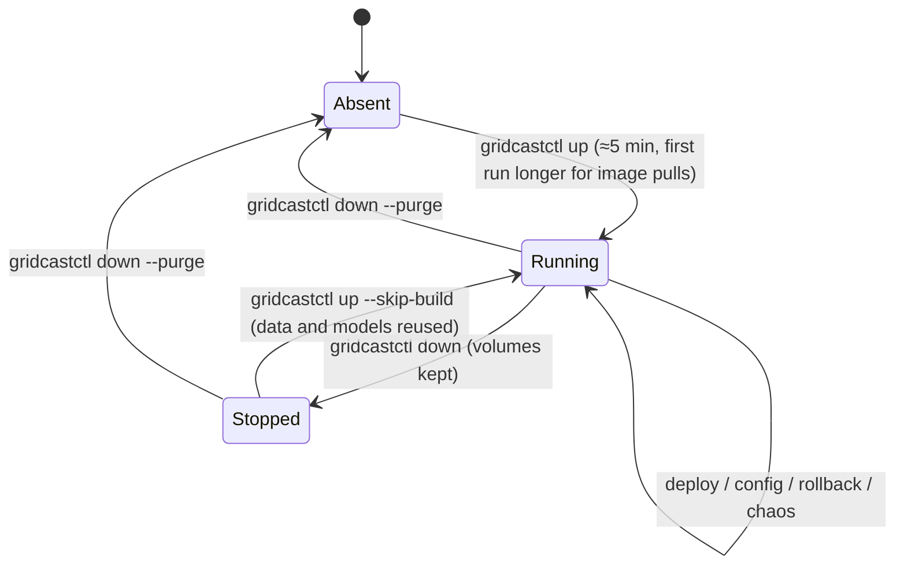

# Operations runbook

Everything is driven by `gridcastctl` (run with `uv run gridcastctl …` from `gridcast/`, or the
`make` targets). Commands that change the estate do so through GitOps, Kubernetes, the model
registry or vendor admin APIs — the same channels a real team uses.

## Lifecycle



`gridcastctl up` steps:

1. Create kind cluster `gridcast` (or reuse) and configure the registry mirror.
2. `docker compose up -d --wait` the platform.
3. Build runtime images and every release in `deploy/releases.yaml`; push to `localhost:5001`.
4. Seed the GitOps repo, create namespaces and Secrets (from `.env`), `kubectl apply -k`.
5. Job `db-migrate` (schema owner): Alembic migrations + reference data.
6. Job `ingest-backfill` (21 days through the vendor APIs); Jobs `model-train` (standard,
   promoted to `production`) and `model-train-hifi` (registered, not promoted) — skipped when
   models already exist.
7. Wait for every Deployment/DaemonSet; print URLs.

Options: `--skip-build`, `--skip-train`, `--skip-hifi`, `--backfill-days N`.

## Command reference

| Command | Purpose |
|---|---|
| `up`, `down [--purge]`, `status`, `verify`, `urls` | lifecycle and health |
| `images build [service…] [--no-push]` | rebuild images (then `restart <deployment>` to pick them up) |
| `deploy <service> <version> [--reason] [--author]` | release through GitOps |
| `rollback <service>` | revert the latest deploy commit for that service |
| `restart <deployment>` | rolling restart (e.g. after a Secret change) |
| `config set KEY VALUE [--file] [--restart deploy]` | change a ConfigMap key through GitOps |
| `config weather-provider wx-primary\|wx-secondary` | switch weather vendor (fallback runbook) |
| `config resources <deployment> [--cpu] [--memory]` | change limits through GitOps |
| `gitops log \| show <sha> \| revert <sha>` | change history and reverts |
| `job migrate \| backfill [--days] \| train [--profile] [--promote] \| pipeline` | one-off jobs; `pipeline` runs a forecast now |
| `model list \| promote <version>` | registry |
| `chaos list \| inject <X> \| status \| reveal [run] \| revert` | incidents |
| `llm check` | verify `OPENROUTER_API_KEY` + `OPENROUTER_MODEL` with one tiny structured request |
| `logs <deployment> [--namespace] [--tail]`, `psql` | convenience |

## Common tasks

**Pick up a code change.**
```bash
uv run gridcastctl images build feature-service
uv run gridcastctl restart feature-service
```
(Pull policy is `Always`, so a restart pulls the rebuilt tag.)

**Ship a new release.** Add a version under the service in `deploy/releases.yaml` (flags +
changelog), `gridcastctl images build <service>`, then
`gridcastctl deploy <service> <version> --reason "…"`.

**Switch to the fallback weather vendor.**
`gridcastctl config weather-provider wx-secondary` (commit + ingestion restart).

**Train / promote models.**
`gridcastctl job train --profile standard --promote` · `gridcastctl model list` ·
`gridcastctl model promote <version>` (forecast-service hot-reloads within 30 s).

**Look inside.** `gridcastctl status`, `kubectl --context kind-gridcast -n gridcast get pods`,
`gridcastctl logs ingestion`, Grafana, Prefect, pgAdmin.

## Troubleshooting

| Symptom | Likely cause | Fix |
|---|---|---|
| `failed to connect to the docker API` | Docker Desktop not running | `open -a Docker`, wait, retry |
| `up` fails pushing an image | registry container restarted / OOM | `docker compose -f infra/compose.yaml --env-file .env up -d registry`, rerun `up` (pushes retry) |
| port already allocated | another process on 5432/3001/… | change the port in `.env`, `make down && make up` |
| pods `ImagePullBackOff` | registry mirror missing on the node (cluster recreated by hand) | rerun `gridcastctl up` (re-applies `hosts.toml`) |
| no plan for the first minutes | pipeline ran before models finished training | wait for the next run or `gridcastctl job pipeline` |
| `verify`: no traces/metrics | collector not ready yet | `kubectl -n observability get pods`; wait a minute |
| Grafana MAPE tile empty | needs ≥ 1 completed hour of published forecasts | wait an hour |
| vendor weather is synthetic | no internet / Open-Meteo unavailable | expected fallback; `WEATHER_TRUTH_MODE=synthetic` forces it |
| chaos run stuck "injected" | interrupted inject/revert | `gridcastctl chaos revert`; if needed `gridcastctl gitops log` + `gitops revert <sha>` |
| everything is slow | Docker VM memory too small | give Docker Desktop ≥ 8 GB |

Full reset: `gridcastctl down --purge && gridcastctl up`.
