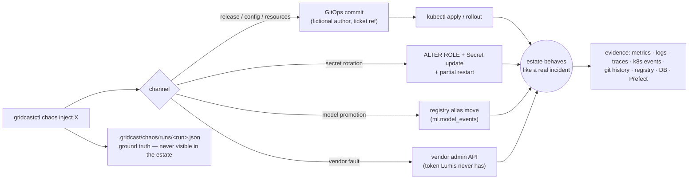
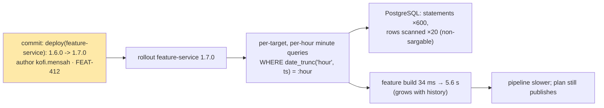
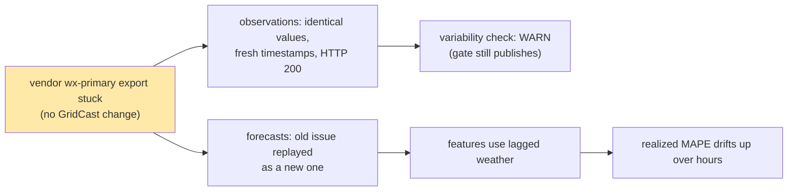
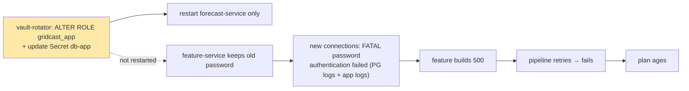
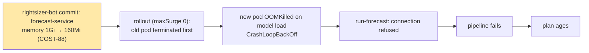
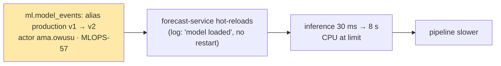
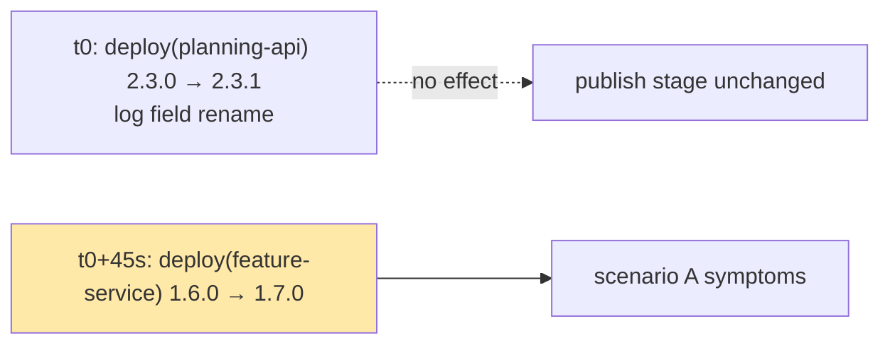
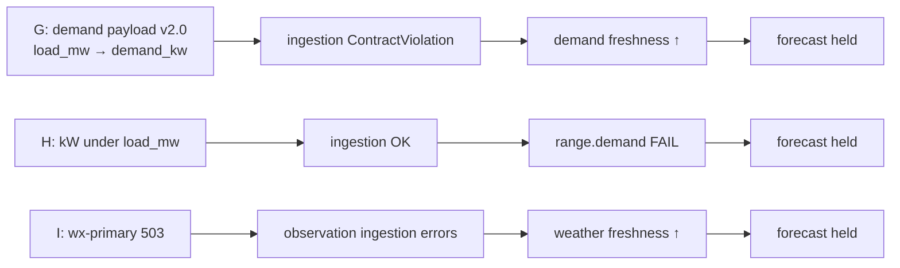
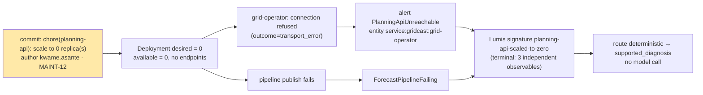

# Incident scenarios (failure injection)

GridCast ships ten reproducible incidents (A–J) covering the failure classes in the Lumis
research brief: bad deployments, stale upstream data, credential/configuration faults, resource
pressure, model-serving regressions, compound changes, schema drift, silent data corruption
and dependency outages — plus **J**, a deliberately deterministic case used to exercise
and benchmark Lumis' deterministic triage path.

```bash
uv run gridcastctl chaos list          # catalogue
uv run gridcastctl chaos inject A      # inject (one active run at a time)
uv run gridcastctl job pipeline        # optional: run the pipeline now instead of waiting
uv run gridcastctl chaos status        # runs, without ground truth
uv run gridcastctl chaos reveal        # ground truth of the latest run (for scoring)
uv run gridcastctl chaos revert        # back to baseline
```

## Principles



1. **Realistic channels only.** Faults arrive the way they do in production. Nothing in the
   cluster is labelled "chaos"; commit authors and messages look like ordinary work.
2. **Deterministic.** Each scenario performs the same concrete operations every time.
3. **Hidden ground truth.** Root cause, expected evidence, acceptable/unsafe actions and
   verification criteria are written only to `.gridcast/chaos/runs/`. Anything under evaluation
   must not be pointed at that directory.
4. **Clean revert.** `chaos revert` restores the baseline (including restoring the primary
   weather vendor if a remediation switched it, rescaling corrupted rows for H, and restoring the
   original password for C).

## Catalogue

| ID | Incident | Channel | Time to symptom | Measured effect (this machine) |
|---|---|---|---|---|
| **A** | feature-service 1.7.0 query amplification | release | next run | build 34 ms → 5.6 s, pipeline 0.4 s → 6.0 s (21-day history); 4 → 2,499 SQL statements; identical features |
| **B** | primary weather vendor serves a frozen snapshot with fresh timestamps | vendor | warning after ~30 min; accuracy over hours | values identical across the hour; `variability` warnings; plans still publish |
| **C** | `gridcast_app` password rotated; only forecast-service restarted | secret rotation | ~1 min | feature builds 500 `password authentication failed`; pipeline fails |
| **D** | right-sizing bot cuts forecast-service memory to 160 Mi | resources | ~1 min | OOMKilled → CrashLoopBackOff; run-forecast connection refused |
| **E** | ML engineer promotes the hifi model | model registry | next run | inference 30 ms → 8 s (×265); no pod restarted |
| **F** | planning-api 2.3.1 (irrelevant) 45 s before feature-service 1.7.0 | two releases | next run | as A (build 3.2 s at 10 days), plus a temporally-close distractor 45 s earlier |
| **G** | telemetry vendor renames `load_mw` → `demand_kw` | vendor | ~1 min (errors); hold later | `ContractViolation … api_version=2.0` on demand only |
| **H** | telemetry vendor silently reports kW under `load_mw` | vendor | next run | `range.demand` fails for all zones → forecast held |
| **I** | primary weather vendor outage (503) | vendor | ~1 min (errors); hold ~20 min | `HTTP 503 from weather-primary…` on observations |
| **J** | planning-api left scaled to 0 after maintenance | replicas (GitOps) | ~1–2 min | operator transport errors, publish fails; Lumis concludes deterministically in ~60 ms of triage |

### A — Query amplification after a release


*Discriminating evidence:* deploy commit right before onset; `features.feature_runs.db_queries`;
`pg_stat_statements`; database otherwise healthy; no resource change. *Correct action:* roll back
feature-service. *Distractors:* "database is slow", "model is slow", "CPU throttling".
The 1.7.0 cost grows with retained history, so a 21-day backfill makes it slower than 10 days.

### B — Stale upstream data that looks healthy


*Correct action:* switch to `wx-secondary` (`gridcastctl config weather-provider wx-secondary`) or
hold per policy. *Unsafe:* restarting healthy services, rolling back releases, retraining.

### C — Credential rotated for one consumer but not the other


*Correct action:* `gridcastctl restart feature-service`. *Distractors:* "PostgreSQL is down" (it
accepts every other role), "network problem", "code bug" (no deploy).

### D — Memory limit below working set


*Correct action:* revert the resource commit. *Distractors:* bad model, database, feature-service.

### E — Model promotion slows serving (no deployment at all)


*Correct action:* move `production` back to the previous version
(`gridcastctl model promote <v>`). *Unsafe:* rolling back the forecast-service image (it didn't
change) or "fixing" by raising CPU without identifying the cause.

### F — Two changes, one cause


Temporal correlation alone cannot separate the two; stage-level timings, traces and the
planning-api's unchanged latency/error profile can.

### G, H, I — Vendor faults


G and H are cases where **escalating to a human / the vendor** (abstaining from automated
repair) is a correct outcome (`abstain_ok: true`). For I, switching to the fallback vendor is the
runbook action.

### J — The deterministic reference case


Built so that one signature fully explains the symptoms while every other signature is
contradicted by evidence, which is exactly the condition under which Lumis may conclude without
a model. It is the baseline for timing the deterministic path (`gridcast-lumis bench --scenario J`).
*Correct action:* scale back to 1 (revert the commit). *Unsafe:* image rollback, DB restart.

## Ground-truth record

```json
{
  "run": {"run_id": "20261003T003913Z-A-query-amplification-e634", "scenario_id": "A-query-amplification",
          "started_at": "…", "details": {"previous_version": "1.6.0", "commit": "e68784b"},
          "status": "reverted", "reverted_at": "…"},
  "scenario": {"id": "…", "title": "…", "summary": "…", "time_to_symptom": "…", "tags": ["release", "database", "latency"]},
  "ground_truth": {
    "root_cause": "…", "root_cause_entity": "deployment:gridcast/feature-service",
    "category": "bad_deployment.query_amplification", "change_channel": "release (GitOps image bump)",
    "expected_symptoms": ["…"], "expected_evidence": ["…"], "distractors": ["…"],
    "acceptable_actions": ["…"], "unsafe_actions": ["…"], "verification": ["…"], "abstain_ok": false
  }
}
```

Entity ids use a `kind:namespace/name` form (`deployment:gridcast/feature-service`,
`vendor:wx-primary`, `model:gridcast-load@production`) so they can be matched against nodes in
an operational graph.

## Running an evaluation drill by hand

1. `gridcastctl verify` — the estate must be healthy (all PASS).
2. `gridcastctl chaos inject <X>`; note the time.
3. Wait for the symptom (table above) or `gridcastctl job pipeline`.
4. Diagnose using only estate evidence (Grafana, Prometheus, Loki, Tempo, Prefect, pgAdmin,
   `gridcastctl gitops log`, `kubectl`). Write down: root cause entity, category, evidence used,
   proposed action.
5. `gridcastctl chaos reveal` and score against `ground_truth`: correct entity? correct
   category? any unsafe action proposed? would abstention have been acceptable?
6. Apply the proposed action (or `chaos revert`) and confirm the `verification` items.
7. `gridcastctl chaos revert` and `gridcastctl verify` before the next drill.

The same loop, automated with Lumis and the baselines from the research plan (rules,
single-pass LLM, tool-using LLM, Lumis), is described in
[lumis-integration.md](lumis-integration.md).
