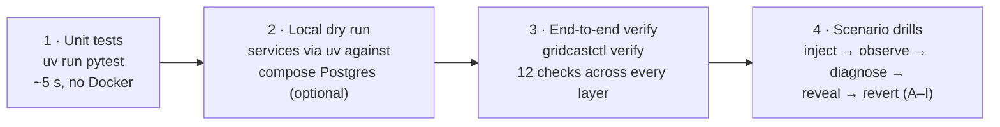

# Testing GridCast

Four layers, from seconds to an hour.



## 1. Unit tests

```bash
cd gridcast
uv sync --all-extras
uv run pytest          # unit tests
uv run ruff check src tests
```

What they cover:

| File | Covers |
|---|---|
| `tests/test_simulation.py` | synthetic weather determinism/plausibility, vendor error model, demand response to heat/weekends/holidays |
| `tests/test_features.py` | as-of discipline (no future data), k = 24 lag fallback, design-matrix order, **train/serve skew guard** (vectorised training features == serving `build_row`) |
| `tests/test_models.py` | quantile ordering, scenario-forest spread |
| `tests/test_vendors.py` | vendor APIs match ingestion contracts; admin auth; outage/stale/schema-break/unit-change behaviour |
| `tests/test_quality_and_chaos.py` | check grading and publish/hold decision; scenario catalogue completeness; ground-truth store; GitOps image bump; release manifest |

## 2. Local dry run without Kubernetes (optional)

Useful when changing service code. Start only the platform, then run services with uv on
free ports (8080–8086 belong to kind):

```bash
docker compose -f infra/compose.yaml --env-file .env up -d postgres prefect s3
export OTEL_SDK_DISABLED=true GRIDCAST_LOG_FORMAT=text
GRIDCAST_DB_USER=gridcast_owner GRIDCAST_DB_PASSWORD=owner-local uv run gridcast db migrate
GRIDCAST_HTTP_PORT=18084 WEATHER_VENDOR_ADMIN_TOKEN=t uv run gridcast serve weather-vendor &
GRIDCAST_HTTP_PORT=18086 GRID_TELEMETRY_ADMIN_TOKEN=t uv run gridcast serve grid-telemetry &
# … ingestion / feature-service / forecast-service / planning-api with GRIDCAST_DB_USER/PASSWORD
# per role and INGEST_* / PIPELINE_* URLs pointing at the 180xx ports, then:
GRIDCAST_DB_USER=gridcast_pipeline GRIDCAST_DB_PASSWORD=pipeline-local \
  PIPELINE_FEATURE_SERVICE_URL=http://localhost:18082 PIPELINE_FORECAST_SERVICE_URL=http://localhost:18081 \
  PIPELINE_PLANNING_API_URL=http://localhost:18080 PREFECT_API_URL=http://localhost:4200/api \
  uv run gridcast pipeline run-once
```

(The compose `kind` network is external, so create the cluster first or
`docker network create kind` for platform-only use.)

## 3. End-to-end verification

```bash
uv run gridcastctl up        # or: make up
uv run gridcastctl verify    # or: make verify
```

| Check | Proves |
|---|---|
| Kubernetes pods ready | every Deployment/DaemonSet is healthy |
| Dispatch plan fresh | the full cycle ingest → features → model → validate → publish works |
| Production model loaded | registry + S3 artifact + hot-load path |
| Database populated | backfill, forecasts and plans exist |
| Metrics: application | OTel SDK → collector → Prometheus OTLP |
| Metrics: Kubernetes | `k8s_cluster` receiver and kubelet cAdvisor scrape |
| Metrics: PostgreSQL | postgres-exporter |
| Metrics: trace service graph | Tempo metrics-generator → Prometheus |
| Logs in Loki | filelog → Loki OTLP, k8s events |
| Traces in Tempo | pipeline traces |
| Prefect flow runs | orchestration evidence |
| Grafana + pgAdmin reachable | UIs |

## 4. Manual test plan (do this before pushing)

Tick each item; expected results come from real runs on this estate.

**Bring-up**
- [ ] `make up` finishes with "GridCast is up" and prints URLs.
- [ ] `make verify` — 12/12 PASS (give it ~2 min after `up` for the first pipeline run).
- [ ] `gridcastctl model list` shows v1 `standard` (production) and v2 `hifi`.

**UIs**
- [ ] Grafana <http://localhost:3001> opens **GridCast — Estate overview**; plan-age tile is green.
- [ ] Grafana **Explore → Tempo → Service graph** shows forecast-pipeline → feature-service / forecast-service / planning-api, grid-operator → planning-api, ingestion → vendors.
- [ ] Click a log line with a `trace_id` in the overview's log panel → opens the trace.
- [ ] Prefect <http://localhost:4200> lists `forecast-pipeline` runs (Completed) with task runs.
- [ ] pgAdmin <http://localhost:5050> → GridCast (owner) → gridcast → **ERD For Database** renders all schemas.
- [ ] SeaweedFS <http://localhost:8888/buckets/gridcast-models/> lists model artifacts; admin UI on <http://localhost:23646>.
- [ ] Planning API docs <http://localhost:8080/docs>; `GET /v1/plans/current` returns a plan.

**Change management**
- [ ] `gridcastctl deploy planning-api 2.3.1 --reason test` → `gitops log` shows the commit; `curl localhost:8080/release` shows 2.3.1; `gridcastctl rollback planning-api` restores 2.3.0.

**Scenarios** (for each: inject, observe, `reveal`, `revert`, `verify`)
- [ ] **A** `chaos inject A` + `job pipeline` → Prefect log "features built: 96 rows, 2499 queries, ~5500 ms"; `features.feature_runs.db_queries` ≈ 2,500; alerts `FeatureBuildSlow`/`ForecastPipelineSlow` fire after 5 min; Grafana "SQL statements / build" jumps.
- [ ] **E** `chaos inject E`, wait 30 s, `job pipeline` → "with model v2 in ~8000 ms"; forecast-service log "model loaded … model_version 2"; no pod restart.
- [ ] **D** `chaos inject D` → forecast-service `OOMKilled`, CrashLoopBackOff; `job pipeline` fails with connection refused; alerts `PodCrashLooping`, later `ForecastPlanStale`.
- [ ] **C** `chaos inject C` → within ~1 min feature-service logs `password authentication failed for user "gridcast_app"`; PostgreSQL logs the same; forecast-service healthy.
- [ ] **H** `chaos inject H`, wait 75 s, `job pipeline` → "forecast held by validation gate: range.demand:…".
- [ ] **G** `chaos inject G` → `curl localhost:8083/status` shows `ContractViolation … api_version=2.0`.
- [ ] **I** `chaos inject I` → ingestion status `HTTP 503 from weather-primary…`; `config weather-provider wx-secondary` recovers freshness.
- [ ] **B** `chaos inject B`, wait ≥ 35 min → `quality.check_results` has `variability.weather_observations` = warn for every station; plans still publish.
- [ ] **J** `chaos inject J` → within ~2 min alert `PlanningApiUnreachable`; `kubectl -n gridcast get deploy planning-api` shows 0/0.
- [ ] **F** `chaos inject F` → two deploy commits 45 s apart in `gitops log`; symptoms as A only.
- [ ] After every revert: `gridcastctl verify` all PASS.

**Teardown**
- [ ] `make down` then `gridcastctl up --skip-build` comes back with data and models intact.
- [ ] `make purge` removes everything.

## 5. Lumis against the estate

```bash
cd lumis && uv sync && uv run pytest     # offline signature tests
uv run gridcast-lumis drill J             # expect: route deterministic, correct_diagnosis
uv run gridcast-lumis drill A             # expect: route human, escalated_with_correct_lead
uv run gridcast-lumis report
```

## Continuous checks

`make check` (ruff + pytest) is fast enough for a pre-commit hook. End-to-end (`verify`) and
scenario drills need the estate, so they are run before pushing and, later, by the Lumis
evaluation harness.
