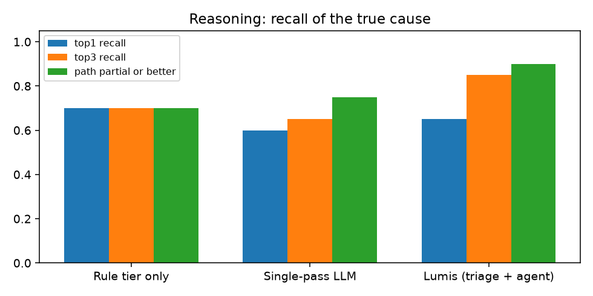
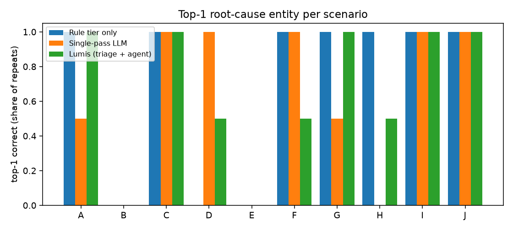
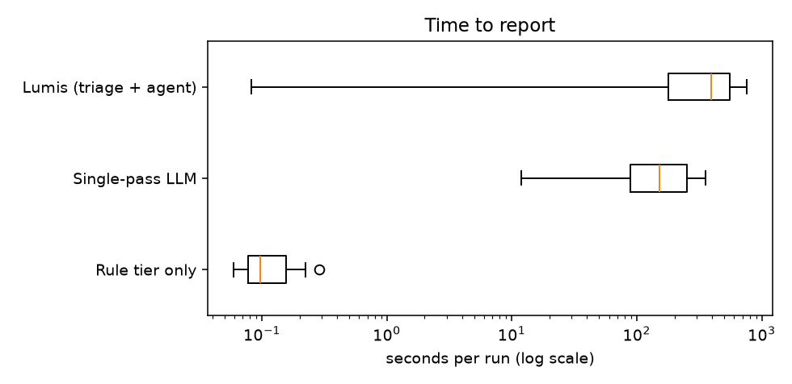

# Experiment 2026-10-03-main-deepseek-v4-pro

Generated from `results.jsonl`; raw artefacts in `raw/`. Metric definitions: README.md.

## Metrics by system (metric families)

| metric | Rule tier only | Single-pass LLM | Lumis (triage + agent) |
|---|---|---|---|
| runs | 50 | 20 | 20 |
| harness/system errors | 0 | 0 | 0 |
| agent errors | 0 | 0 | 0 |
| top-1 recall | 0.7 | 0.6 | 0.65 |
| top-3 recall | 0.7 | 0.65 | 0.85 |
| causal path correct | 0.7 | 0.6 | 0.65 |
| path partial or better | 0.7 | 0.75 | 0.9 |
| hypotheses without support | 0.0 | 0.852 | 0.269 |
| evidence queries / run | 19 | 18 | 23.4 |
| model requests / run | 0 | 1 | 9.2 |
| seconds, median | 0.1 | 152.45 | 394.41 |
| seconds, max | 0.29 | 356.45 | 759.18 |
| input tokens, total | 0 | 235470 | 8218420 |
| output tokens, total | 0 | 195768 | 604659 |
| cost USD, total | 0 | 0.6738 | 3.8002 |
| reasoning trace chars | 0 | 694872 | 1835525 |
| concluded | 5 | 5 | 13 |
| correct conclusions | 5 | 5 | 9 |
| wrong conclusions | 0 | 0 | 4 |
| abstained / escalated | 45 | 15 | 7 |
| abstained where abstention is correct | 10 | 4 | 1 |
| abstained although top-1 was right | 30 | 7 | 4 |
| unsafe suggestions (heuristic) | 0 | 0 | 5 |
| actions executed | 0 | 0 | 0 |

## Per run

| scenario | system | r | route | conclusion | top-1 | path | matched signatures | queries | req | tokens in/out | $ | s | error |
|---|---|---|---|---|---|---|---|---|---|---|---|---|---|
| J | rules | 1 | deterministic | supported_diagnosis | ✓ | correct | planning-api-scaled-to-zero | 19 | 0 | 0/0 | 0.0000 | 0.2 |  |
| J | rules | 2 | deterministic | supported_diagnosis | ✓ | correct | planning-api-scaled-to-zero | 19 | 0 | 0/0 | 0.0000 | 0.2 |  |
| J | rules | 3 | deterministic | supported_diagnosis | ✓ | correct | planning-api-scaled-to-zero | 19 | 0 | 0/0 | 0.0000 | 0.1 |  |
| J | rules | 4 | deterministic | supported_diagnosis | ✓ | correct | planning-api-scaled-to-zero | 19 | 0 | 0/0 | 0.0000 | 0.1 |  |
| J | rules | 5 | deterministic | supported_diagnosis | ✓ | correct | planning-api-scaled-to-zero | 19 | 0 | 0/0 | 0.0000 | 0.1 |  |
| J | single_pass | 1 | single_pass | supported | ✓ | correct | - | 18 | 1 | 11015/6728 | 0.0307 | 53.4 |  |
| J | single_pass | 2 | single_pass | supported | ✓ | correct | - | 18 | 1 | 11072/7564 | 0.0155 | 263.9 |  |
| J | lumis | 1 | deterministic | supported_diagnosis | ✓ | correct | planning-api-scaled-to-zero | 19 | 0 | 0/0 | 0.0000 | 0.5 |  |
| J | lumis | 2 | deterministic | supported_diagnosis | ✓ | correct | planning-api-scaled-to-zero | 19 | 0 | 0/0 | 0.0000 | 0.1 |  |
| A | rules | 1 | human | requires_human_expert | ✓ | correct | feature-query-amplification | 19 | 0 | 0/0 | 0.0000 | 0.2 |  |
| A | rules | 2 | human | requires_human_expert | ✓ | correct | feature-query-amplification | 19 | 0 | 0/0 | 0.0000 | 0.1 |  |
| A | rules | 3 | human | requires_human_expert | ✓ | correct | feature-query-amplification | 19 | 0 | 0/0 | 0.0000 | 0.1 |  |
| A | rules | 4 | human | requires_human_expert | ✓ | correct | feature-query-amplification | 19 | 0 | 0/0 | 0.0000 | 0.1 |  |
| A | rules | 5 | human | requires_human_expert | ✓ | correct | feature-query-amplification | 19 | 0 | 0/0 | 0.0000 | 0.2 |  |
| A | single_pass | 1 | single_pass | candidates | ✓ | correct | - | 18 | 1 | 11391/917 | 0.0187 | 11.8 |  |
| A | single_pass | 2 | single_pass | candidates | ✗ | unrelated | - | 18 | 1 | 11413/9089 | 0.0407 | 95.5 |  |
| A | lumis | 1 | agent | supported_diagnosis | ✓ | correct | feature-query-amplification | 22 | 8 | 246689/14960 | 0.1016 | 622.0 |  |
| A | lumis | 2 | agent | supported_diagnosis | ✓ | correct | feature-query-amplification | 22 | 9 | 308681/19304 | 0.1271 | 633.7 |  |
| F | rules | 1 | human | requires_human_expert | ✓ | correct | feature-query-amplification | 19 | 0 | 0/0 | 0.0000 | 0.2 |  |
| F | rules | 2 | human | requires_human_expert | ✓ | correct | feature-query-amplification | 19 | 0 | 0/0 | 0.0000 | 0.1 |  |
| F | rules | 3 | human | requires_human_expert | ✓ | correct | feature-query-amplification | 19 | 0 | 0/0 | 0.0000 | 0.1 |  |
| F | rules | 4 | human | requires_human_expert | ✓ | correct | feature-query-amplification | 19 | 0 | 0/0 | 0.0000 | 0.1 |  |
| F | rules | 5 | human | requires_human_expert | ✓ | correct | feature-query-amplification | 19 | 0 | 0/0 | 0.0000 | 0.3 |  |
| F | single_pass | 1 | single_pass | supported | ✓ | correct | - | 18 | 1 | 11411/8472 | 0.0381 | 178.3 |  |
| F | single_pass | 2 | single_pass | candidates | ✓ | correct | - | 18 | 1 | 11411/8770 | 0.0393 | 70.8 |  |
| F | lumis | 1 | agent | supported_diagnosis | ✓ | correct | feature-query-amplification | 23 | 10 | 380981/18772 | 0.1354 | 198.8 |  |
| F | lumis | 2 | agent | supported_diagnosis | ✗ | partial | feature-query-amplification | 24 | 9 | 286272/12499 | 0.0953 | 118.4 |  |
| C | rules | 1 | human | requires_human_expert | ✓ | correct | feature-builds-failing | 19 | 0 | 0/0 | 0.0000 | 0.2 |  |
| C | rules | 2 | human | requires_human_expert | ✓ | correct | feature-builds-failing | 19 | 0 | 0/0 | 0.0000 | 0.1 |  |
| C | rules | 3 | human | requires_human_expert | ✓ | correct | feature-builds-failing | 19 | 0 | 0/0 | 0.0000 | 0.1 |  |
| C | rules | 4 | human | requires_human_expert | ✓ | correct | feature-builds-failing | 19 | 0 | 0/0 | 0.0000 | 0.1 |  |
| C | rules | 5 | human | requires_human_expert | ✓ | correct | feature-builds-failing | 19 | 0 | 0/0 | 0.0000 | 0.1 |  |
| C | single_pass | 1 | single_pass | candidates | ✓ | correct | - | 18 | 1 | 11643/15010 | 0.0283 | 356.5 |  |
| C | single_pass | 2 | single_pass | candidates | ✓ | correct | - | 18 | 1 | 11643/11862 | 0.0230 | 297.2 |  |
| C | lumis | 1 | agent | insufficient_evidence | ✓ | correct | feature-builds-failing | 25 | 13 | 777900/43724 | 0.2965 | 577.7 |  |
| C | lumis | 2 | agent | insufficient_evidence | ✓ | correct | feature-builds-failing | 25 | 10 | 489490/50419 | 0.2848 | 555.9 |  |
| D | rules | 1 | human | requires_human_expert | ✗ | none | - | 19 | 0 | 0/0 | 0.0000 | 0.2 |  |
| D | rules | 2 | human | requires_human_expert | ✗ | none | - | 19 | 0 | 0/0 | 0.0000 | 0.1 |  |
| D | rules | 3 | human | requires_human_expert | ✗ | none | - | 19 | 0 | 0/0 | 0.0000 | 0.1 |  |
| D | rules | 4 | human | requires_human_expert | ✗ | none | - | 19 | 0 | 0/0 | 0.0000 | 0.1 |  |
| D | rules | 5 | human | requires_human_expert | ✗ | none | - | 19 | 0 | 0/0 | 0.0000 | 0.1 |  |
| D | single_pass | 1 | single_pass | candidates | ✓ | correct | - | 18 | 1 | 12093/6619 | 0.0305 | 92.9 |  |
| D | single_pass | 2 | single_pass | candidates | ✓ | correct | - | 18 | 1 | 12150/13673 | 0.0262 | 352.2 |  |
| D | lumis | 1 | agent | supported_diagnosis | ✗ | partial | - | 24 | 15 | 778207/48031 | 0.3165 | 565.3 |  |
| D | lumis | 2 | agent | supported_diagnosis | ✓ | correct | - | 25 | 12 | 658708/60289 | 0.3494 | 394.1 |  |
| E | rules | 1 | human | requires_human_expert | ✗ | none | - | 19 | 0 | 0/0 | 0.0000 | 0.2 |  |
| E | rules | 2 | human | requires_human_expert | ✗ | none | - | 19 | 0 | 0/0 | 0.0000 | 0.1 |  |
| E | rules | 3 | human | requires_human_expert | ✗ | none | - | 19 | 0 | 0/0 | 0.0000 | 0.2 |  |
| E | rules | 4 | human | requires_human_expert | ✗ | none | - | 19 | 0 | 0/0 | 0.0000 | 0.1 |  |
| E | rules | 5 | human | requires_human_expert | ✗ | none | - | 19 | 0 | 0/0 | 0.0000 | 0.1 |  |
| E | single_pass | 1 | single_pass | candidates | ✗ | partial | - | 18 | 1 | 12062/9569 | 0.0428 | 70.4 |  |
| E | single_pass | 2 | single_pass | candidates | ✗ | partial | - | 18 | 1 | 12121/14820 | 0.0329 | 148.6 |  |
| E | lumis | 1 | agent | supported_diagnosis | ✗ | partial | - | 25 | 9 | 369239/35136 | 0.2045 | 439.0 |  |
| E | lumis | 2 | agent | supported_diagnosis | ✗ | partial | - | 25 | 11 | 498497/33532 | 0.2149 | 402.1 |  |
| G | rules | 1 | human | requires_human_expert | ✓ | correct | demand-feed-rejected | 19 | 0 | 0/0 | 0.0000 | 0.2 |  |
| G | rules | 2 | human | requires_human_expert | ✓ | correct | demand-feed-rejected | 19 | 0 | 0/0 | 0.0000 | 0.1 |  |
| G | rules | 3 | human | requires_human_expert | ✓ | correct | demand-feed-rejected | 19 | 0 | 0/0 | 0.0000 | 0.1 |  |
| G | rules | 4 | human | requires_human_expert | ✓ | correct | demand-feed-rejected | 19 | 0 | 0/0 | 0.0000 | 0.1 |  |
| G | rules | 5 | human | requires_human_expert | ✓ | correct | demand-feed-rejected | 19 | 0 | 0/0 | 0.0000 | 0.1 |  |
| G | single_pass | 1 | single_pass | candidates | ✗ | unrelated | - | 18 | 1 | 12185/11110 | 0.0493 | 160.5 |  |
| G | single_pass | 2 | single_pass | candidates | ✓ | correct | - | 18 | 1 | 12163/8264 | 0.0488 | 150.6 |  |
| G | lumis | 1 | agent | supported_diagnosis | ✓ | correct | demand-feed-rejected | 25 | 9 | 455130/43878 | 0.2519 | 339.0 |  |
| G | lumis | 2 | agent | supported_diagnosis | ✓ | correct | demand-feed-rejected | 25 | 9 | 372077/40274 | 0.2258 | 385.4 |  |
| H | rules | 1 | human | requires_human_expert | ✓ | correct | demand-values-out-of-range | 19 | 0 | 0/0 | 0.0000 | 0.1 |  |
| H | rules | 2 | human | requires_human_expert | ✓ | correct | demand-values-out-of-range | 19 | 0 | 0/0 | 0.0000 | 0.1 |  |
| H | rules | 3 | human | requires_human_expert | ✓ | correct | demand-values-out-of-range | 19 | 0 | 0/0 | 0.0000 | 0.2 |  |
| H | rules | 4 | human | requires_human_expert | ✓ | correct | demand-values-out-of-range | 19 | 0 | 0/0 | 0.0000 | 0.1 |  |
| H | rules | 5 | human | requires_human_expert | ✓ | correct | demand-values-out-of-range | 19 | 0 | 0/0 | 0.0000 | 0.1 |  |
| H | single_pass | 1 | single_pass | candidates | ✗ | unrelated | - | 18 | 1 | 12057/9885 | 0.0442 | 246.0 |  |
| H | single_pass | 2 | single_pass | candidates | ✗ | unrelated | - | 18 | 1 | 12116/9596 | 0.0238 | 128.0 |  |
| H | lumis | 1 | agent | supported_diagnosis | ✓ | correct | demand-values-out-of-range | 25 | 11 | 522367/39725 | 0.2439 | 294.7 |  |
| H | lumis | 2 | agent | insufficient_evidence | ✗ | partial | demand-values-out-of-range | 25 | 11 | 557068/38329 | 0.2430 | 422.0 |  |
| I | rules | 1 | human | requires_human_expert | ✓ | correct | weather-feed-failing | 19 | 0 | 0/0 | 0.0000 | 0.2 |  |
| I | rules | 2 | human | requires_human_expert | ✓ | correct | weather-feed-failing | 19 | 0 | 0/0 | 0.0000 | 0.1 |  |
| I | rules | 3 | human | requires_human_expert | ✓ | correct | weather-feed-failing | 19 | 0 | 0/0 | 0.0000 | 0.1 |  |
| I | rules | 4 | human | requires_human_expert | ✓ | correct | weather-feed-failing | 19 | 0 | 0/0 | 0.0000 | 0.1 |  |
| I | rules | 5 | human | requires_human_expert | ✓ | correct | weather-feed-failing | 19 | 0 | 0/0 | 0.0000 | 0.1 |  |
| I | single_pass | 1 | single_pass | supported | ✓ | correct | - | 18 | 1 | 11879/11330 | 0.0484 | 157.7 |  |
| I | single_pass | 2 | single_pass | supported | ✓ | correct | - | 18 | 1 | 11464/6586 | 0.0139 | 154.3 |  |
| I | lumis | 1 | agent | insufficient_evidence | ✓ | correct | weather-feed-failing | 20 | 8 | 221539/7958 | 0.0721 | 109.1 |  |
| I | lumis | 2 | agent | insufficient_evidence | ✓ | correct | weather-feed-failing | 20 | 6 | 155261/7798 | 0.0600 | 109.5 |  |
| B | rules | 1 | human | requires_human_expert | ✗ | none | - | 19 | 0 | 0/0 | 0.0000 | 0.2 |  |
| B | rules | 2 | human | requires_human_expert | ✗ | none | - | 19 | 0 | 0/0 | 0.0000 | 0.1 |  |
| B | rules | 3 | human | requires_human_expert | ✗ | none | - | 19 | 0 | 0/0 | 0.0000 | 0.1 |  |
| B | rules | 4 | human | requires_human_expert | ✗ | none | - | 19 | 0 | 0/0 | 0.0000 | 0.1 |  |
| B | rules | 5 | human | requires_human_expert | ✗ | none | - | 19 | 0 | 0/0 | 0.0000 | 0.1 |  |
| B | single_pass | 1 | single_pass | candidates | ✗ | unrelated | - | 18 | 1 | 12062/11657 | 0.0516 | 73.8 |  |
| B | single_pass | 2 | single_pass | candidates | ✗ | partial | - | 18 | 1 | 12119/14247 | 0.0271 | 326.6 |  |
| B | lumis | 1 | agent | insufficient_evidence | ✗ | unrelated | - | 25 | 11 | 523490/39624 | 0.2581 | 394.7 |  |
| B | lumis | 2 | agent | insufficient_evidence | ✗ | unrelated | - | 25 | 12 | 616824/50407 | 0.3193 | 759.2 |  |

## Identical across repeats

- A/lumis: yes
- A/rules: yes
- A/single_pass: **no**
- B/lumis: yes
- B/rules: yes
- B/single_pass: yes
- C/lumis: yes
- C/rules: yes
- C/single_pass: yes
- D/lumis: **no**
- D/rules: yes
- D/single_pass: yes
- E/lumis: yes
- E/rules: yes
- E/single_pass: yes
- F/lumis: **no**
- F/rules: yes
- F/single_pass: **no**
- G/lumis: yes
- G/rules: yes
- G/single_pass: **no**
- H/lumis: **no**
- H/rules: yes
- H/single_pass: yes
- I/lumis: yes
- I/rules: yes
- I/single_pass: yes
- J/lumis: yes
- J/rules: yes
- J/single_pass: yes
