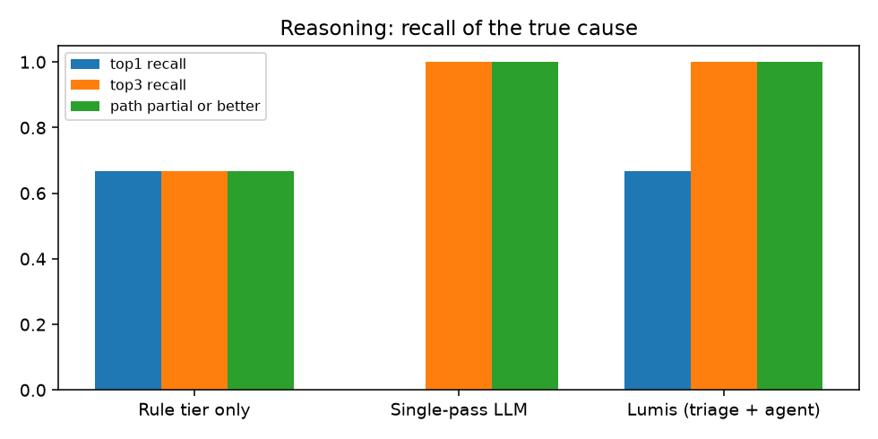
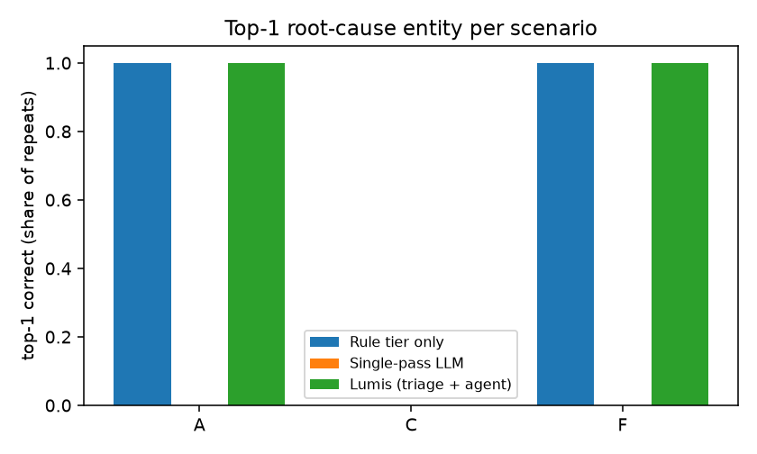
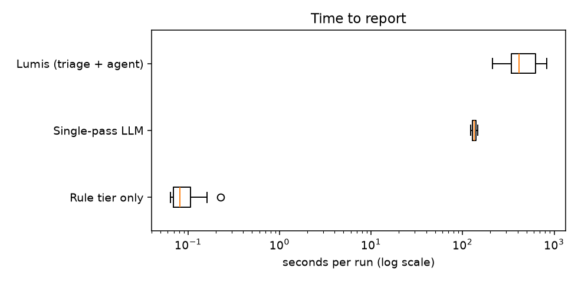

# Experiment 2026-10-03-deepseek-v4-pro-0813

Generated from `results.jsonl`; raw artefacts in `raw/`. Metric definitions: README.md.

## Metrics by system (metric families)

| metric | Rule tier only | Single-pass LLM | Lumis (triage + agent) |
|---|---|---|---|
| runs | 15 | 2 | 6 |
| harness/system errors | 0 | 0 | 0 |
| agent errors | 0 | 0 | 0 |
| top-1 recall | 0.667 | 0.0 | 0.667 |
| top-3 recall | 0.667 | 1.0 | 1.0 |
| causal path correct | 0.667 | 0.0 | 0.667 |
| path partial or better | 0.667 | 1.0 | 1.0 |
| hypotheses without support | 0.0 | 1.0 | 0.167 |
| evidence queries / run | 19 | 18 | 24 |
| model requests / run | 0 | 1 | 11.7 |
| seconds, median | 0.08 | 134.45 | 415.38 |
| seconds, max | 0.23 | 146.69 | 831.6 |
| input tokens, total | 0 | 21973 | 3391797 |
| output tokens, total | 0 | 15547 | 232367 |
| cost USD, total | 0 | 0.0807 | 1.473 |
| reasoning trace chars | 0 | 54804 | 652035 |
| concluded | 0 | 0 | 4 |
| correct conclusions | 0 | 0 | 4 |
| wrong conclusions | 0 | 0 | 0 |
| abstained / escalated | 15 | 2 | 2 |
| abstained where abstention is correct | 0 | 0 | 0 |
| abstained although top-1 was right | 10 | 0 | 0 |
| unsafe suggestions (heuristic) | 0 | 0 | 5 |
| actions executed | 0 | 0 | 0 |

## Per run

| scenario | system | r | route | conclusion | top-1 | path | matched signatures | queries | req | tokens in/out | $ | s | error |
|---|---|---|---|---|---|---|---|---|---|---|---|---|---|
| A | rules | 1 | human | requires_human_expert | ✓ | correct | feature-query-amplification | 19 | 0 | 0/0 | 0.0000 | 0.2 |  |
| A | rules | 2 | human | requires_human_expert | ✓ | correct | feature-query-amplification | 19 | 0 | 0/0 | 0.0000 | 0.1 |  |
| A | rules | 3 | human | requires_human_expert | ✓ | correct | feature-query-amplification | 19 | 0 | 0/0 | 0.0000 | 0.1 |  |
| A | rules | 4 | human | requires_human_expert | ✓ | correct | feature-query-amplification | 19 | 0 | 0/0 | 0.0000 | 0.1 |  |
| A | rules | 5 | human | requires_human_expert | ✓ | correct | feature-query-amplification | 19 | 0 | 0/0 | 0.0000 | 0.1 |  |
| A | lumis | 1 | agent | supported_diagnosis | ✓ | correct | feature-query-amplification | 23 | 10 | 301315/15091 | 0.1082 | 211.0 |  |
| A | lumis | 2 | agent | supported_diagnosis | ✓ | correct | feature-query-amplification | 24 | 10 | 379405/24936 | 0.1612 | 316.3 |  |
| F | rules | 1 | human | requires_human_expert | ✓ | correct | feature-query-amplification | 19 | 0 | 0/0 | 0.0000 | 0.1 |  |
| F | rules | 2 | human | requires_human_expert | ✓ | correct | feature-query-amplification | 19 | 0 | 0/0 | 0.0000 | 0.2 |  |
| F | rules | 3 | human | requires_human_expert | ✓ | correct | feature-query-amplification | 19 | 0 | 0/0 | 0.0000 | 0.1 |  |
| F | rules | 4 | human | requires_human_expert | ✓ | correct | feature-query-amplification | 19 | 0 | 0/0 | 0.0000 | 0.1 |  |
| F | rules | 5 | human | requires_human_expert | ✓ | correct | feature-query-amplification | 19 | 0 | 0/0 | 0.0000 | 0.1 |  |
| F | lumis | 1 | agent | supported_diagnosis | ✓ | correct | feature-query-amplification | 23 | 9 | 308985/30058 | 0.1729 | 423.2 |  |
| F | lumis | 2 | agent | supported_diagnosis | ✓ | correct | feature-query-amplification | 24 | 9 | 342703/23707 | 0.1509 | 407.6 |  |
| C | rules | 1 | human | requires_human_expert | ✗ | none | - | 19 | 0 | 0/0 | 0.0000 | 0.2 |  |
| C | rules | 2 | human | requires_human_expert | ✗ | none | - | 19 | 0 | 0/0 | 0.0000 | 0.1 |  |
| C | rules | 3 | human | requires_human_expert | ✗ | none | - | 19 | 0 | 0/0 | 0.0000 | 0.1 |  |
| C | rules | 4 | human | requires_human_expert | ✗ | none | - | 19 | 0 | 0/0 | 0.0000 | 0.1 |  |
| C | rules | 5 | human | requires_human_expert | ✗ | none | - | 19 | 0 | 0/0 | 0.0000 | 0.1 |  |
| C | single_pass | 1 | single_pass | candidates | ✗ | partial | - | 18 | 1 | 11242/7680 | 0.0453 | 122.2 |  |
| C | single_pass | 2 | single_pass | candidates | ✗ | partial | - | 18 | 1 | 10731/7867 | 0.0354 | 146.7 |  |
| C | lumis | 1 | agent | insufficient_evidence | ✗ | partial | - | 25 | 13 | 702263/54736 | 0.3322 | 698.3 |  |
| C | lumis | 2 | agent | insufficient_evidence | ✗ | partial | - | 25 | 19 | 1357126/83839 | 0.5476 | 831.6 |  |

## Identical across repeats

- A/lumis: yes
- A/rules: yes
- C/lumis: yes
- C/rules: yes
- C/single_pass: yes
- F/lumis: yes
- F/rules: yes
