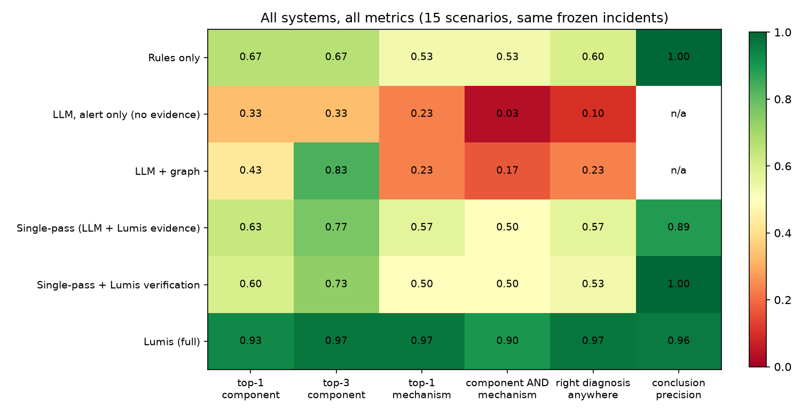
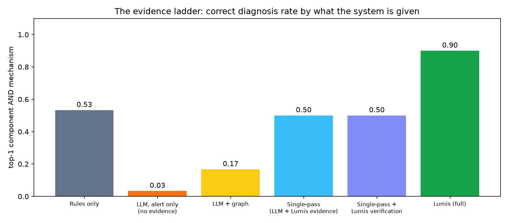
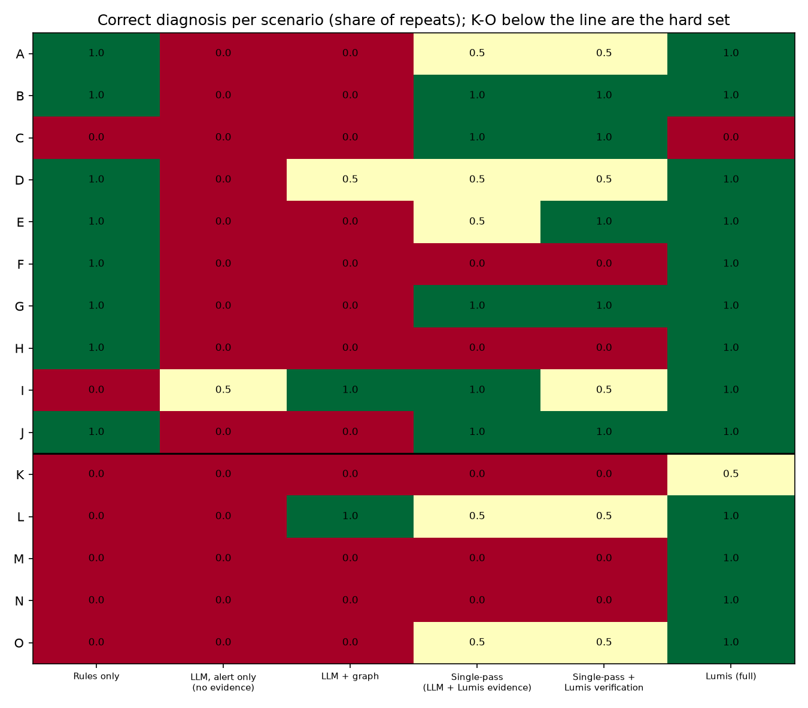
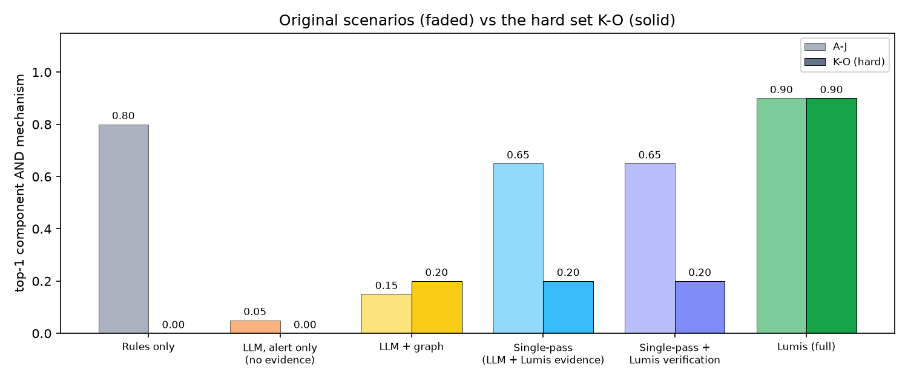
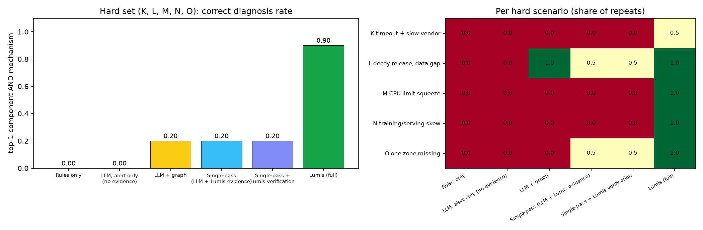
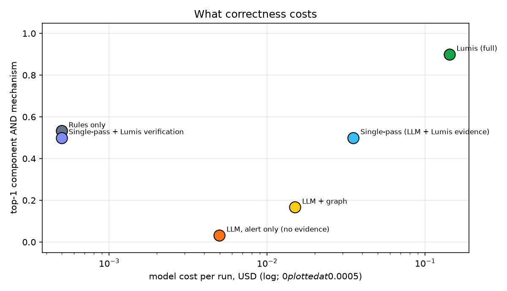

# Evidence ladder

Scenarios: A, B, C, D, E, F, G, H, I, J, K, L, M, N, O. Generated by `gridcast-lumis ladder`.
Mechanism uses the regex rubric in `src/gridcast_lumis/ladder.py` (RUBRIC).
For Rules only, a correct top-1 is the matched signature: a lead for a human. Rules conclude
only when a terminal signature is sufficient (J); everything else escalates.

| metric | Rules only | LLM, alert only (no evidence) | LLM + graph | LLM + Lumis evidence (one shot) | one shot + Lumis verification | Lumis |
|---|---|---|---|---|---|---|
| runs | 75 | 30 | 30 | 30 | 30 | 30 |
| top-1 component | 0.667 | 0.333 | 0.433 | 0.633 | 0.6 | 0.933 |
| top-3 component | 0.667 | 0.333 | 0.833 | 0.767 | 0.733 | 0.967 |
| top-1 mechanism (rubric) | 0.533 | 0.233 | 0.233 | 0.567 | 0.5 | 0.967 |
| top-1 component AND mechanism | 0.533 | 0.033 | 0.167 | 0.5 | 0.5 | 0.9 |
| right diagnosis anywhere in output | 0.6 | 0.1 | 0.233 | 0.567 | 0.533 | 0.967 |
| concluded | 5 | 0 | 0 | 9 | 3 | 24 |
| conclusion precision | 1.0 | None | None | 0.889 | 1.0 | 0.958 |
| cost USD | 0 | 0.1497 | 0.4506 | 1.0551 | 0 | 4.2808 |
| seconds, median | 0.134 | None | None | 223.53050000000002 | 0.0 | 225.436 |

## Top-1 diagnosis (component AND mechanism) per scenario

| scenario | Rules only | LLM, alert only (no evidence) | LLM + graph | LLM + Lumis evidence (one shot) | one shot + Lumis verification | Lumis |
|---|---|---|---|---|---|---|
| A | 5/5 | 0/2 | 0/2 | 1/2 | 1/2 | 2/2 |
| B | 5/5 | 0/2 | 0/2 | 2/2 | 2/2 | 2/2 |
| C | 0/5 | 0/2 | 0/2 | 2/2 | 2/2 | 0/2 |
| D | 5/5 | 0/2 | 1/2 | 1/2 | 1/2 | 2/2 |
| E | 5/5 | 0/2 | 0/2 | 1/2 | 2/2 | 2/2 |
| F | 5/5 | 0/2 | 0/2 | 0/2 | 0/2 | 2/2 |
| G | 5/5 | 0/2 | 0/2 | 2/2 | 2/2 | 2/2 |
| H | 5/5 | 0/2 | 0/2 | 0/2 | 0/2 | 2/2 |
| I | 0/5 | 1/2 | 2/2 | 2/2 | 1/2 | 2/2 |
| J | 5/5 | 0/2 | 0/2 | 2/2 | 2/2 | 2/2 |
| K | 0/5 | 0/2 | 0/2 | 0/2 | 0/2 | 1/2 |
| L | 0/5 | 0/2 | 2/2 | 1/2 | 1/2 | 2/2 |
| M | 0/5 | 0/2 | 0/2 | 0/2 | 0/2 | 2/2 |
| N | 0/5 | 0/2 | 0/2 | 0/2 | 0/2 | 2/2 |
| O | 0/5 | 0/2 | 0/2 | 1/2 | 1/2 | 2/2 |

## Charts

