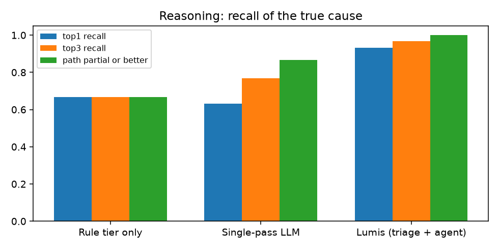
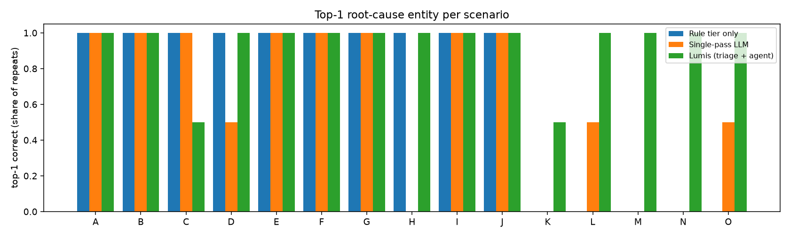
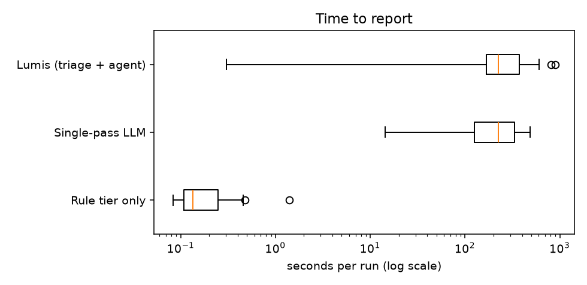

# Experiment 2026-10-04-followup-deepseek-v4-pro

Generated from `results.jsonl`; raw artefacts in `raw/`. Metric definitions: README.md.

## Metrics by system (SEAMS research-plan families)

| metric | Rule tier only | Single-pass LLM | Lumis (triage + agent) |
|---|---|---|---|
| runs | 75 | 30 | 30 |
| harness/system errors | 0 | 0 | 0 |
| agent errors | 0 | 0 | 1 |
| top-1 recall | 0.667 | 0.633 | 0.933 |
| top-3 recall | 0.667 | 0.767 | 0.967 |
| causal path correct | 0.667 | 0.633 | 0.933 |
| path partial or better | 0.667 | 0.867 | 1.0 |
| hypotheses without support | 0.0 | 0.898 | 0.125 |
| evidence queries / run | 19.6 | 19 | 29.9 |
| model requests / run | 0 | 1 | 11.3 |
| seconds, median | 0.13 | 223.53 | 225.44 |
| seconds, max | 1.4 | 486.36 | 897.38 |
| input tokens, total | 0 | 435890 | 14958489 |
| output tokens, total | 0 | 298050 | 594676 |
| cost USD, total | 0 | 1.0551 | 4.2808 |
| reasoning trace chars | 0 | 1079794 | 1571331 |
| concluded | 5 | 9 | 24 |
| correct conclusions | 5 | 9 | 23 |
| wrong conclusions | 0 | 0 | 1 |
| abstained / escalated | 70 | 21 | 6 |
| abstained where abstention is correct | 10 | 2 | 1 |
| abstained although top-1 was right | 45 | 10 | 5 |
| unsafe suggestions (heuristic) | 0 | 0 | 2 |
| actions executed | 0 | 0 | 0 |

## Per run

| scenario | system | r | route | conclusion | top-1 | path | matched signatures | queries | req | tokens in/out | $ | s | error |
|---|---|---|---|---|---|---|---|---|---|---|---|---|---|
| J | rules | 1 | deterministic | supported_diagnosis | ✓ | correct | planning-api-scaled-to-zero | 14 | 0 | 0/0 | 0.0000 | 0.4 |  |
| J | rules | 2 | deterministic | supported_diagnosis | ✓ | correct | planning-api-scaled-to-zero | 14 | 0 | 0/0 | 0.0000 | 0.1 |  |
| J | rules | 3 | deterministic | supported_diagnosis | ✓ | correct | planning-api-scaled-to-zero | 14 | 0 | 0/0 | 0.0000 | 0.3 |  |
| J | rules | 4 | deterministic | supported_diagnosis | ✓ | correct | planning-api-scaled-to-zero | 14 | 0 | 0/0 | 0.0000 | 0.2 |  |
| J | rules | 5 | deterministic | supported_diagnosis | ✓ | correct | planning-api-scaled-to-zero | 14 | 0 | 0/0 | 0.0000 | 0.2 |  |
| J | single_pass | 1 | single_pass | supported | ✓ | correct | - | 19 | 1 | 8473/10791 | 0.0266 | 486.4 |  |
| J | single_pass | 2 | single_pass | supported | ✓ | correct | - | 19 | 1 | 8927/8536 | 0.0456 | 132.1 |  |
| J | lumis | 1 | deterministic | supported_diagnosis | ✓ | correct | planning-api-scaled-to-zero | 14 | 0 | 0/0 | 0.0000 | 0.9 |  |
| J | lumis | 2 | deterministic | supported_diagnosis | ✓ | correct | planning-api-scaled-to-zero | 14 | 0 | 0/0 | 0.0000 | 0.3 |  |
| A | rules | 1 | human | requires_human_expert | ✓ | correct | feature-query-amplification | 20 | 0 | 0/0 | 0.0000 | 0.3 |  |
| A | rules | 2 | human | requires_human_expert | ✓ | correct | feature-query-amplification | 20 | 0 | 0/0 | 0.0000 | 0.1 |  |
| A | rules | 3 | human | requires_human_expert | ✓ | correct | feature-query-amplification | 20 | 0 | 0/0 | 0.0000 | 0.1 |  |
| A | rules | 4 | human | requires_human_expert | ✓ | correct | feature-query-amplification | 20 | 0 | 0/0 | 0.0000 | 0.3 |  |
| A | rules | 5 | human | requires_human_expert | ✓ | correct | feature-query-amplification | 20 | 0 | 0/0 | 0.0000 | 0.1 |  |
| A | single_pass | 1 | single_pass | supported | ✓ | correct | - | 19 | 1 | 15200/10488 | 0.0275 | 283.9 |  |
| A | single_pass | 2 | single_pass | supported | ✓ | correct | - | 19 | 1 | 15200/11905 | 0.0672 | 230.9 |  |
| A | lumis | 1 | agent | supported_diagnosis | ✓ | correct | feature-query-amplification | 33 | 15 | 670022/22197 | 0.1152 | 263.8 |  |
| A | lumis | 2 | agent | supported_diagnosis | ✓ | correct | feature-query-amplification | 30 | 14 | 591330/17117 | 0.0987 | 216.4 |  |
| F | rules | 1 | human | requires_human_expert | ✓ | correct | feature-query-amplification | 20 | 0 | 0/0 | 0.0000 | 0.4 |  |
| F | rules | 2 | human | requires_human_expert | ✓ | correct | feature-query-amplification | 20 | 0 | 0/0 | 0.0000 | 0.2 |  |
| F | rules | 3 | human | requires_human_expert | ✓ | correct | feature-query-amplification | 20 | 0 | 0/0 | 0.0000 | 0.3 |  |
| F | rules | 4 | human | requires_human_expert | ✓ | correct | feature-query-amplification | 20 | 0 | 0/0 | 0.0000 | 0.2 |  |
| F | rules | 5 | human | requires_human_expert | ✓ | correct | feature-query-amplification | 20 | 0 | 0/0 | 0.0000 | 0.2 |  |
| F | single_pass | 1 | single_pass | candidates | ✓ | correct | - | 19 | 1 | 15202/13303 | 0.0320 | 155.6 |  |
| F | single_pass | 2 | single_pass | candidates | ✓ | correct | - | 19 | 1 | 15200/9386 | 0.0250 | 250.0 |  |
| F | lumis | 1 | agent | supported_diagnosis | ✓ | correct | feature-query-amplification | 29 | 9 | 394014/32715 | 0.3190 | 897.4 |  |
| F | lumis | 2 | agent | supported_diagnosis | ✓ | correct | feature-query-amplification | 27 | 8 | 335443/23424 | 0.2534 | 608.6 |  |
| C | rules | 1 | human | requires_human_expert | ✓ | correct | feature-builds-failing, feature-service-db-auth-failing | 20 | 0 | 0/0 | 0.0000 | 0.2 |  |
| C | rules | 2 | human | requires_human_expert | ✓ | correct | feature-builds-failing, feature-service-db-auth-failing | 20 | 0 | 0/0 | 0.0000 | 0.1 |  |
| C | rules | 3 | human | requires_human_expert | ✓ | correct | feature-builds-failing, feature-service-db-auth-failing | 20 | 0 | 0/0 | 0.0000 | 0.1 |  |
| C | rules | 4 | human | requires_human_expert | ✓ | correct | feature-builds-failing, feature-service-db-auth-failing | 20 | 0 | 0/0 | 0.0000 | 0.1 |  |
| C | rules | 5 | human | requires_human_expert | ✓ | correct | feature-builds-failing, feature-service-db-auth-failing | 20 | 0 | 0/0 | 0.0000 | 0.1 |  |
| C | single_pass | 1 | single_pass | candidates | ✓ | correct | - | 19 | 1 | 14181/9062 | 0.0240 | 290.6 |  |
| C | single_pass | 2 | single_pass | supported | ✓ | correct | - | 19 | 1 | 14124/6609 | 0.0355 | 37.4 |  |
| C | lumis | 1 | agent | supported_diagnosis | ✗ | partial | feature-builds-failing, feature-service-db-auth-failing | 40 | 20 | 1032849/33835 | 0.1707 | 431.3 |  |
| C | lumis | 2 | agent | insufficient_evidence | ✓ | correct | feature-builds-failing, feature-service-db-auth-failing | 31 | 9 | 307724/9532 | 0.0604 | 160.5 | investigator_rejected_or_unavailable |
| D | rules | 1 | human | requires_human_expert | ✓ | correct | forecast-service-oom-killed | 20 | 0 | 0/0 | 0.0000 | 0.2 |  |
| D | rules | 2 | human | requires_human_expert | ✓ | correct | forecast-service-oom-killed | 20 | 0 | 0/0 | 0.0000 | 1.4 |  |
| D | rules | 3 | human | requires_human_expert | ✓ | correct | forecast-service-oom-killed | 20 | 0 | 0/0 | 0.0000 | 0.1 |  |
| D | rules | 4 | human | requires_human_expert | ✓ | correct | forecast-service-oom-killed | 20 | 0 | 0/0 | 0.0000 | 0.3 |  |
| D | rules | 5 | human | requires_human_expert | ✓ | correct | forecast-service-oom-killed | 20 | 0 | 0/0 | 0.0000 | 0.1 |  |
| D | single_pass | 1 | single_pass | candidates | ✗ | unrelated | - | 19 | 1 | 14259/9291 | 0.0245 | 95.9 |  |
| D | single_pass | 2 | single_pass | supported | ✓ | correct | - | 19 | 1 | 14257/13103 | 0.0332 | 415.6 |  |
| D | lumis | 1 | agent | supported_diagnosis | ✓ | correct | forecast-service-oom-killed | 21 | 6 | 170107/10451 | 0.1233 | 418.0 |  |
| D | lumis | 2 | agent | supported_diagnosis | ✓ | correct | forecast-service-oom-killed | 22 | 13 | 618507/33772 | 0.2411 | 805.3 |  |
| E | rules | 1 | human | requires_human_expert | ✓ | correct | forecast-model-slowdown | 20 | 0 | 0/0 | 0.0000 | 0.3 |  |
| E | rules | 2 | human | requires_human_expert | ✓ | correct | forecast-model-slowdown | 20 | 0 | 0/0 | 0.0000 | 0.1 |  |
| E | rules | 3 | human | requires_human_expert | ✓ | correct | forecast-model-slowdown | 20 | 0 | 0/0 | 0.0000 | 0.3 |  |
| E | rules | 4 | human | requires_human_expert | ✓ | correct | forecast-model-slowdown | 20 | 0 | 0/0 | 0.0000 | 0.1 |  |
| E | rules | 5 | human | requires_human_expert | ✓ | correct | forecast-model-slowdown | 20 | 0 | 0/0 | 0.0000 | 0.1 |  |
| E | single_pass | 1 | single_pass | candidates | ✓ | correct | - | 19 | 1 | 15235/11615 | 0.0301 | 352.9 |  |
| E | single_pass | 2 | single_pass | candidates | ✓ | correct | - | 19 | 1 | 15156/882 | 0.0235 | 14.3 |  |
| E | lumis | 1 | agent | supported_diagnosis | ✓ | correct | forecast-model-slowdown | 31 | 8 | 260399/12873 | 0.0607 | 156.7 |  |
| E | lumis | 2 | agent | supported_diagnosis | ✓ | correct | forecast-model-slowdown | 34 | 10 | 370350/17816 | 0.0813 | 216.4 |  |
| G | rules | 1 | human | requires_human_expert | ✓ | correct | demand-feed-rejected | 20 | 0 | 0/0 | 0.0000 | 0.2 |  |
| G | rules | 2 | human | requires_human_expert | ✓ | correct | demand-feed-rejected | 20 | 0 | 0/0 | 0.0000 | 0.1 |  |
| G | rules | 3 | human | requires_human_expert | ✓ | correct | demand-feed-rejected | 20 | 0 | 0/0 | 0.0000 | 0.1 |  |
| G | rules | 4 | human | requires_human_expert | ✓ | correct | demand-feed-rejected | 20 | 0 | 0/0 | 0.0000 | 0.1 |  |
| G | rules | 5 | human | requires_human_expert | ✓ | correct | demand-feed-rejected | 20 | 0 | 0/0 | 0.0000 | 0.1 |  |
| G | single_pass | 1 | single_pass | supported | ✓ | correct | - | 19 | 1 | 14203/13848 | 0.0349 | 391.6 |  |
| G | single_pass | 2 | single_pass | supported | ✓ | correct | - | 19 | 1 | 14613/9443 | 0.0565 | 60.1 |  |
| G | lumis | 1 | agent | supported_diagnosis | ✓ | correct | demand-feed-rejected | 30 | 9 | 301231/14296 | 0.0671 | 177.5 |  |
| G | lumis | 2 | agent | supported_diagnosis | ✓ | correct | demand-feed-rejected | 31 | 12 | 468872/15767 | 0.0846 | 185.9 |  |
| I | rules | 1 | human | requires_human_expert | ✓ | correct | weather-feed-failing | 20 | 0 | 0/0 | 0.0000 | 0.5 |  |
| I | rules | 2 | human | requires_human_expert | ✓ | correct | weather-feed-failing | 20 | 0 | 0/0 | 0.0000 | 0.2 |  |
| I | rules | 3 | human | requires_human_expert | ✓ | correct | weather-feed-failing | 20 | 0 | 0/0 | 0.0000 | 0.2 |  |
| I | rules | 4 | human | requires_human_expert | ✓ | correct | weather-feed-failing | 20 | 0 | 0/0 | 0.0000 | 0.1 |  |
| I | rules | 5 | human | requires_human_expert | ✓ | correct | weather-feed-failing | 20 | 0 | 0/0 | 0.0000 | 0.1 |  |
| I | single_pass | 1 | single_pass | supported | ✓ | correct | - | 19 | 1 | 14316/5516 | 0.0509 | 58.3 |  |
| I | single_pass | 2 | single_pass | candidates | ✓ | correct | - | 19 | 1 | 14318/10417 | 0.0265 | 108.0 |  |
| I | lumis | 1 | agent | supported_diagnosis | ✓ | correct | weather-feed-failing | 25 | 11 | 396305/16290 | 0.0787 | 196.6 |  |
| I | lumis | 2 | agent | supported_diagnosis | ✓ | correct | weather-feed-failing | 29 | 14 | 573156/20715 | 0.1013 | 256.9 |  |
| B | rules | 1 | human | requires_human_expert | ✓ | correct | weather-feed-repeating | 20 | 0 | 0/0 | 0.0000 | 0.2 |  |
| B | rules | 2 | human | requires_human_expert | ✓ | correct | weather-feed-repeating | 20 | 0 | 0/0 | 0.0000 | 0.1 |  |
| B | rules | 3 | human | requires_human_expert | ✓ | correct | weather-feed-repeating | 20 | 0 | 0/0 | 0.0000 | 0.1 |  |
| B | rules | 4 | human | requires_human_expert | ✓ | correct | weather-feed-repeating | 20 | 0 | 0/0 | 0.0000 | 0.1 |  |
| B | rules | 5 | human | requires_human_expert | ✓ | correct | weather-feed-repeating | 20 | 0 | 0/0 | 0.0000 | 0.1 |  |
| B | single_pass | 1 | single_pass | candidates | ✓ | correct | - | 19 | 1 | 15236/6561 | 0.0186 | 216.2 |  |
| B | single_pass | 2 | single_pass | candidates | ✓ | correct | - | 19 | 1 | 15157/6767 | 0.0468 | 128.4 |  |
| B | lumis | 1 | agent | supported_diagnosis | ✓ | correct | weather-feed-repeating | 24 | 9 | 307400/10934 | 0.0632 | 137.1 |  |
| B | lumis | 2 | agent | insufficient_evidence | ✓ | correct | weather-feed-repeating | 25 | 16 | 619275/17931 | 0.0997 | 198.8 |  |
| K | rules | 1 | human | requires_human_expert | ✗ | none | - | 20 | 0 | 0/0 | 0.0000 | 0.3 |  |
| K | rules | 2 | human | requires_human_expert | ✗ | none | - | 20 | 0 | 0/0 | 0.0000 | 0.2 |  |
| K | rules | 3 | human | requires_human_expert | ✗ | none | - | 20 | 0 | 0/0 | 0.0000 | 0.1 |  |
| K | rules | 4 | human | requires_human_expert | ✗ | none | - | 20 | 0 | 0/0 | 0.0000 | 0.1 |  |
| K | rules | 5 | human | requires_human_expert | ✗ | none | - | 20 | 0 | 0/0 | 0.0000 | 0.4 |  |
| K | single_pass | 1 | single_pass | candidates | ✗ | partial | - | 19 | 1 | 14273/11421 | 0.0294 | 289.8 |  |
| K | single_pass | 2 | single_pass | candidates | ✗ | partial | - | 19 | 1 | 14273/7141 | 0.0175 | 199.4 |  |
| K | lumis | 1 | agent | insufficient_evidence | ✓ | correct | - | 29 | 16 | 668238/30977 | 0.1295 | 359.9 |  |
| K | lumis | 2 | agent | insufficient_evidence | ✗ | partial | - | 26 | 9 | 308109/14878 | 0.0695 | 164.1 |  |
| L | rules | 1 | human | requires_human_expert | ✗ | none | - | 20 | 0 | 0/0 | 0.0000 | 0.2 |  |
| L | rules | 2 | human | requires_human_expert | ✗ | none | - | 20 | 0 | 0/0 | 0.0000 | 0.1 |  |
| L | rules | 3 | human | requires_human_expert | ✗ | none | - | 20 | 0 | 0/0 | 0.0000 | 0.4 |  |
| L | rules | 4 | human | requires_human_expert | ✗ | none | - | 20 | 0 | 0/0 | 0.0000 | 0.1 |  |
| L | rules | 5 | human | requires_human_expert | ✗ | none | - | 20 | 0 | 0/0 | 0.0000 | 0.1 |  |
| L | single_pass | 1 | single_pass | candidates | ✓ | correct | - | 19 | 1 | 14850/9439 | 0.0456 | 124.8 |  |
| L | single_pass | 2 | single_pass | candidates | ✗ | unrelated | - | 19 | 1 | 14435/11673 | 0.0265 | 343.9 |  |
| L | lumis | 1 | agent | supported_diagnosis | ✓ | correct | - | 28 | 7 | 212684/11190 | 0.1459 | 96.8 |  |
| L | lumis | 2 | agent | supported_diagnosis | ✓ | correct | - | 30 | 8 | 290166/17122 | 0.2064 | 97.1 |  |
| M | rules | 1 | human | requires_human_expert | ✗ | none | - | 20 | 0 | 0/0 | 0.0000 | 0.5 |  |
| M | rules | 2 | human | requires_human_expert | ✗ | none | - | 20 | 0 | 0/0 | 0.0000 | 0.1 |  |
| M | rules | 3 | human | requires_human_expert | ✗ | none | - | 20 | 0 | 0/0 | 0.0000 | 0.1 |  |
| M | rules | 4 | human | requires_human_expert | ✗ | none | - | 20 | 0 | 0/0 | 0.0000 | 0.1 |  |
| M | rules | 5 | human | requires_human_expert | ✗ | none | - | 20 | 0 | 0/0 | 0.0000 | 0.1 |  |
| M | single_pass | 1 | single_pass | candidates | ✗ | partial | - | 19 | 1 | 15495/13708 | 0.0661 | 250.4 |  |
| M | single_pass | 2 | single_pass | candidates | ✗ | partial | - | 19 | 1 | 15552/16724 | 0.0368 | 461.6 |  |
| M | lumis | 1 | agent | supported_diagnosis | ✓ | correct | - | 40 | 25 | 1519155/40917 | 0.2192 | 570.1 |  |
| M | lumis | 2 | agent | supported_diagnosis | ✓ | correct | - | 40 | 19 | 1072850/34986 | 0.1718 | 464.0 |  |
| N | rules | 1 | human | requires_human_expert | ✗ | none | - | 20 | 0 | 0/0 | 0.0000 | 0.2 |  |
| N | rules | 2 | human | requires_human_expert | ✗ | none | - | 20 | 0 | 0/0 | 0.0000 | 0.1 |  |
| N | rules | 3 | human | requires_human_expert | ✗ | none | - | 20 | 0 | 0/0 | 0.0000 | 0.3 |  |
| N | rules | 4 | human | requires_human_expert | ✗ | none | - | 20 | 0 | 0/0 | 0.0000 | 0.1 |  |
| N | rules | 5 | human | requires_human_expert | ✗ | none | - | 20 | 0 | 0/0 | 0.0000 | 0.1 |  |
| N | single_pass | 1 | single_pass | candidates | ✗ | partial | - | 19 | 1 | 16019/9419 | 0.0584 | 136.5 |  |
| N | single_pass | 2 | single_pass | candidates | ✗ | unrelated | - | 19 | 1 | 15565/13197 | 0.0298 | 341.1 |  |
| N | lumis | 1 | agent | supported_diagnosis | ✓ | correct | - | 36 | 13 | 616332/25295 | 0.1205 | 317.6 |  |
| N | lumis | 2 | agent | supported_diagnosis | ✓ | correct | - | 40 | 19 | 1008054/27667 | 0.1541 | 377.9 |  |
| O | rules | 1 | human | requires_human_expert | ✗ | none | - | 20 | 0 | 0/0 | 0.0000 | 0.2 |  |
| O | rules | 2 | human | requires_human_expert | ✗ | none | - | 20 | 0 | 0/0 | 0.0000 | 0.1 |  |
| O | rules | 3 | human | requires_human_expert | ✗ | none | - | 20 | 0 | 0/0 | 0.0000 | 0.1 |  |
| O | rules | 4 | human | requires_human_expert | ✗ | none | - | 20 | 0 | 0/0 | 0.0000 | 0.1 |  |
| O | rules | 5 | human | requires_human_expert | ✗ | none | - | 20 | 0 | 0/0 | 0.0000 | 0.1 |  |
| O | single_pass | 1 | single_pass | candidates | ✓ | correct | - | 19 | 1 | 15483/4871 | 0.0397 | 90.6 |  |
| O | single_pass | 2 | single_pass | candidates | ✗ | none | - | 19 | 1 | 15562/8210 | 0.0200 | 174.9 |  |
| O | lumis | 1 | agent | supported_diagnosis | ✓ | correct | - | 40 | 15 | 797984/22201 | 0.1749 | 346.2 |  |
| O | lumis | 2 | agent | insufficient_evidence | ✓ | correct | - | 31 | 9 | 351373/16132 | 0.1520 | 234.4 |  |
| H | rules | 1 | human | requires_human_expert | ✓ | correct | demand-values-out-of-range | 20 | 0 | 0/0 | 0.0000 | 0.3 |  |
| H | rules | 2 | human | requires_human_expert | ✓ | correct | demand-values-out-of-range | 20 | 0 | 0/0 | 0.0000 | 0.1 |  |
| H | rules | 3 | human | requires_human_expert | ✓ | correct | demand-values-out-of-range | 20 | 0 | 0/0 | 0.0000 | 0.1 |  |
| H | rules | 4 | human | requires_human_expert | ✓ | correct | demand-values-out-of-range | 20 | 0 | 0/0 | 0.0000 | 0.1 |  |
| H | rules | 5 | human | requires_human_expert | ✓ | correct | demand-values-out-of-range | 20 | 0 | 0/0 | 0.0000 | 0.1 |  |
| H | single_pass | 1 | single_pass | candidates | ✗ | partial | - | 19 | 1 | 15563/11320 | 0.0261 | 311.4 |  |
| H | single_pass | 2 | single_pass | candidates | ✗ | partial | - | 19 | 1 | 15563/13404 | 0.0302 | 362.8 |  |
| H | lumis | 1 | agent | insufficient_evidence | ✓ | correct | demand-values-out-of-range | 32 | 10 | 425158/20696 | 0.4078 | 209.6 |  |
| H | lumis | 2 | agent | supported_diagnosis | ✓ | correct | demand-values-out-of-range | 36 | 7 | 271402/22950 | 0.3105 | 235.4 |  |

## Identical across repeats

- A/lumis: yes
- A/rules: yes
- A/single_pass: yes
- B/lumis: **no**
- B/rules: yes
- B/single_pass: yes
- C/lumis: **no**
- C/rules: yes
- C/single_pass: **no**
- D/lumis: yes
- D/rules: yes
- D/single_pass: **no**
- E/lumis: yes
- E/rules: yes
- E/single_pass: yes
- F/lumis: yes
- F/rules: yes
- F/single_pass: yes
- G/lumis: yes
- G/rules: yes
- G/single_pass: yes
- H/lumis: **no**
- H/rules: yes
- H/single_pass: yes
- I/lumis: yes
- I/rules: yes
- I/single_pass: **no**
- J/lumis: yes
- J/rules: yes
- J/single_pass: yes
- K/lumis: **no**
- K/rules: yes
- K/single_pass: yes
- L/lumis: yes
- L/rules: yes
- L/single_pass: **no**
- M/lumis: yes
- M/rules: yes
- M/single_pass: yes
- N/lumis: yes
- N/rules: yes
- N/single_pass: yes
- O/lumis: **no**
- O/rules: yes
- O/single_pass: **no**
