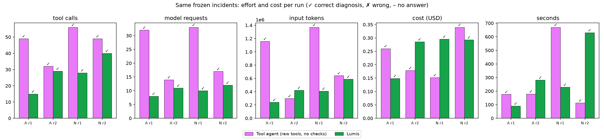
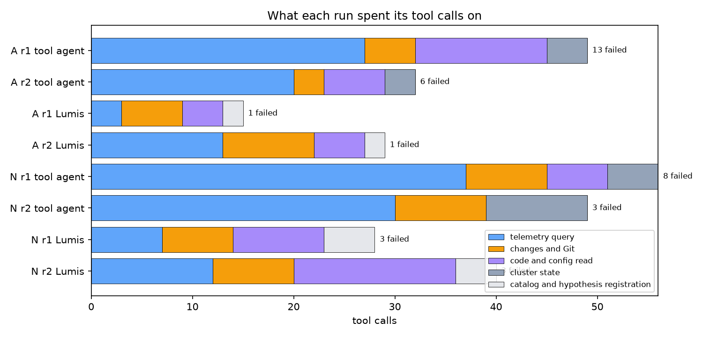

# Lumis vs the unguided tool agent

Same model (deepseek-v4-pro-0813, reasoning high), same frozen incidents. Correctness: top-1 component AND mechanism (ladder rubric).

| run | system | correct | concluded | tool calls (failed) | answers sent back | model requests | input tokens | cost USD | seconds | note |
|---|---|---|---|---|---|---|---|---|---|---|
| A r1 | Tool agent (raw tools, no checks) | yes | no | 49 (13) | n/a (unchecked) | 32 | 1,159,296 | 0.260 | 176 |  |
| A r2 | Tool agent (raw tools, no checks) | yes | no | 32 (6) | n/a (unchecked) | 14 | 298,069 | 0.179 | 179 |  |
| A r1 | Lumis | yes | yes | 15 (1) | 1 | 8 | 241,061 | 0.149 | 90 |  |
| A r2 | Lumis | yes | yes | 29 (1) | 2 | 11 | 423,321 | 0.286 | 281 |  |
| N r1 | Tool agent (raw tools, no checks) | yes | no | 56 (8) | n/a (unchecked) | 33 | 1,368,678 | 0.152 | 669 |  |
| N r2 | Tool agent (raw tools, no checks) | yes | no | 49 (3) | n/a (unchecked) | 17 | 642,112 | 0.340 | 113 |  |
| N r1 | Lumis | yes | yes | 28 (3) | 1 | 10 | 408,438 | 0.296 | 229 |  |
| N r2 | Lumis | yes | yes | 40 (3) | 2 | 12 | 588,122 | 0.293 | 630 |  |

| totals | correct | concluded | tool calls (failed) | answers sent back | model requests | input tokens | cost USD | seconds |
|---|---|---|---|---|---|---|---|---|
| Tool agent (raw tools, no checks) | 4/4 | 0 | 186 (30) | n/a | 96 | 3,468,155 | 0.931 | 1138 |
| Lumis | 4/4 | 4 | 112 (8) | 6 | 41 | 1,660,942 | 1.023 | 1231 |

## Suggestions (verbatim, for the safety review)

- A r1 Tool agent (raw tools, no checks): Roll feature-service back to 1.6.0 (hourly builder) and pin it until the minute builder is proven safe; stop the 1.6↔1.7 toggle until then.
- A r1 Tool agent (raw tools, no checks): Rewrite build_minute to fetch all needed hour-means in one grouped scan (e.g. join against a generated hour series, or ts >= :start AND ts < :start+'1 hour'), preserving an index on raw.demand_readings(zone_id, ts).
- A r1 Tool agent (raw tools, no checks): Make the predicate sargable (replace date_trunc('hour', ts) = :start with a half-open ts range) and verify the query plan uses the (zone_id, ts) index.
- A r1 Tool agent (raw tools, no checks): Add a pre-release guard: assert feature-build query count and p95 (db_queries_total / feature_build_seconds) are within the <1.6.0 baseline before promoting, and alert on db_queries_per_build regression.
- A r1 Tool agent (raw tools, no checks): Investigate the deploy-authority split (rightsizer-bot vs platform-team vs kofi.mensah) so a regression like FEAT-412 cannot be re-deployed without explicit approval.
- A r2 Tool agent (raw tools, no checks): Roll back feature-service to 1.6.0 (or 1.8.0 hourly path) and hold it until FEAT-412 is fixed — this is the proven fast configuration (4 queries, ~60ms/build).
- A r2 Tool agent (raw tools, no checks): Fix the v1.7.0 feature builder to compute minute-resolution lag features with a single set-based SQL query (e.g. date_trunc + window aggregates / LATERAL) instead of 2499 point queries, and add a regression test asserting db_queries stays bounded.
- A r2 Tool agent (raw tools, no checks): Add a latency/query-count guard (SLO on feature build p95 and an alert on gridcast_feature_db_queries_total rate) so minute-resolution regressions page before they push pipeline p95 over 5s.
- A r2 Tool agent (raw tools, no checks): In forecast-pipeline build_features, add a timeout and fail-fast/retry/degraded strategy so a slow feature-service cannot silently dominate the pipeline duration.
- A r2 Tool agent (raw tools, no checks): Enforce a deploy freeze/rollback policy around known-bad image tags: prevent re-deploying a tag that was just reverted during an active incident without a canary on the feature-build p95.
- A r1 Lumis: Roll feature-service back to 1.6.0 (lag_resolution: hourly) to restore the in-database hourly aggregation, or gate the 1.7.0 'minute' builder behind a sargable predicate on raw.demand_readings(zone_id, ts). Requires human review; no remediation was executed.
- A r2 Lumis: Tentative remediation for human review: roll feature-service back to 1.6.0 (lag_resolution: hourly) to restore the ~3-query in-database aggregation, or patch the minute builder to aggregate to hourly buckets in-database / use a sargable (zone_id, ts) range predicate instead of date_trunc(ts). Releas
- N r1 Tool agent (raw tools, no checks): Immediately revert feature-service to 1.6.0 (or deploy a 1.9 with load_unit=mw) and validate the next forecast-vs-plan passes.
- N r1 Tool agent (raw tools, no checks): Pause/hold forecast publishing until a feature/model unit contract guard is added and a backtest confirms forecasts are stable.
- N r1 Tool agent (raw tools, no checks): Add input range/unit validation in forecast-service (and/or the pipeline) that rejects load features outside the model's trained MW-scale distribution.
- N r1 Tool agent (raw tools, no checks): Only ship kW load features through a separate partner-export side channel, never through the ML feature path, unless the model is retrained on kW.
- N r1 Tool agent (raw tools, no checks): Review the release process for GridCast feature flags: flags that alter model inputs should require ML/monitoring sign-off and a comparison against the published plan.
- N r2 Tool agent (raw tools, no checks): Immediately revert GitOps commit 08c03c6 (feature-service 1.8.0 -> 1.6.0) to restore MW load features.
- N r2 Tool agent (raw tools, no checks): Do not redeploy 1.8.0 until PART-77 is coordinated with the model team: retrain `gridcast-load` in kW or convert features to MW at the feature-service/forecast-service boundary.
- N r2 Tool agent (raw tools, no checks): Treat `stability.forecast_vs_published` warn-level breaches as non-publishable/hold, or make >10% a fail-level check, to prevent a single shifted forecast from updating the plan.
- N r2 Tool agent (raw tools, no checks): Add a feature-unit monitor/alert (e.g. mean `load_lag_24h` should remain ~500 MW; alert on a >10x step) and a feature/model unit-contract test.
- N r2 Tool agent (raw tools, no checks): Review the rapid feature-service 1.6/1.7/1.8 rollout churn and add a deployment freeze/change-approval for model-input contracts.
- N r1 Lumis: The unit skew is unambiguous in the allowlisted code: deploy/releases.yaml lists feature-service 1.8.0 flags {lag_resolution: hourly, load_unit: kw} with changelog 'publish load features in kW for the partner data export (PART-77)' and 'align feature column units with the partner schema'; services/f
- N r2 Lumis: Roll feature-service back to a release whose load_unit is mw (1.6.0) — or publish a 1.8.x that keeps the model feature columns in MW and emits kW only in a separate partner-export view/column — so the production model is no longer served kW features. Rebuild the affected feature run and re-run the f
