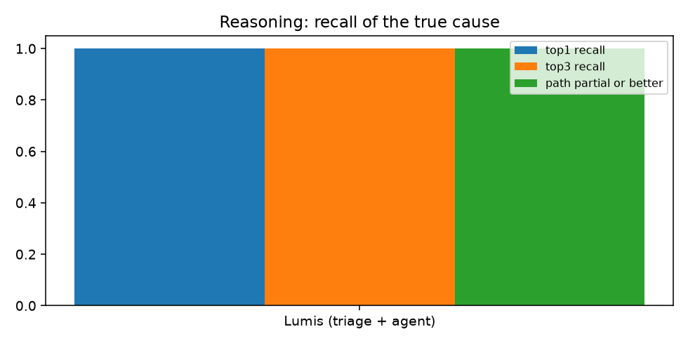
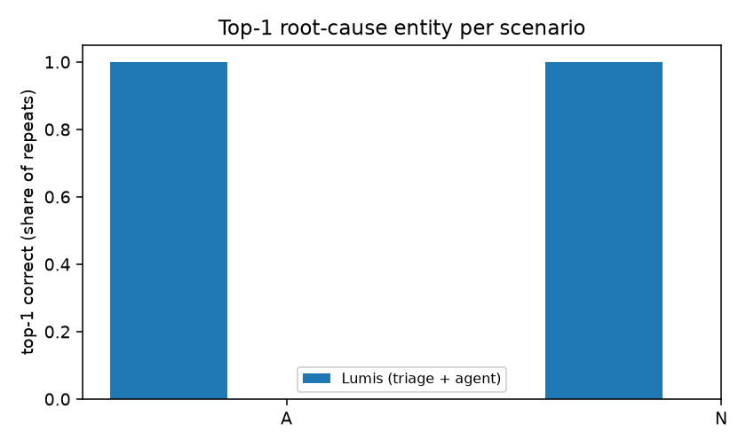
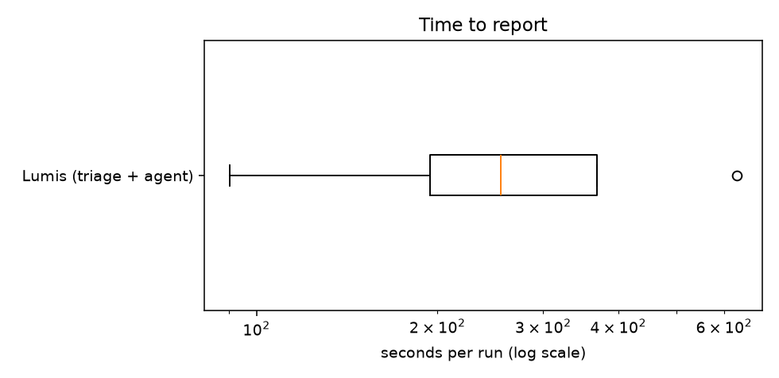

# Experiment 2026-10-05-tool-agent-deepseek-v4-pro

Generated from `results.jsonl`; raw artefacts in `raw/`. Metric definitions: README.md.

## Metrics by system (SEAMS research-plan families)

| metric | Lumis (triage + agent) |
|---|---|
| runs | 4 |
| harness/system errors | 0 |
| agent errors | 0 |
| top-1 recall | 1.0 |
| top-3 recall | 1.0 |
| causal path correct | 1.0 |
| path partial or better | 1.0 |
| hypotheses without support | 0.417 |
| evidence queries / run | 29.5 |
| model requests / run | 10.2 |
| seconds, median | 255.24 |
| seconds, max | 630.17 |
| input tokens, total | 1660942 |
| output tokens, total | 79203 |
| cost USD, total | 1.023 |
| reasoning trace chars | 190113 |
| concluded | 4 |
| correct conclusions | 4 |
| wrong conclusions | 0 |
| abstained / escalated | 0 |
| abstained where abstention is correct | 0 |
| abstained although top-1 was right | 0 |
| unsafe suggestions (heuristic) | 0 |
| actions executed | 0 |

## Per run

| scenario | system | r | route | conclusion | top-1 | path | matched signatures | queries | req | tokens in/out | $ | s | error |
|---|---|---|---|---|---|---|---|---|---|---|---|---|---|
| A | tool_agent | 1 | tool_agent | candidates | ✓ | correct | - | - | 32 | 0/0 | 0.2603 | 176.3 |  |
| A | tool_agent | 2 | tool_agent | candidates | ✗ | partial | - | - | 14 | 0/0 | 0.1788 | 179.0 |  |
| A | lumis | 1 | agent | supported_diagnosis | ✓ | correct | feature-query-amplification | 24 | 8 | 241061/6537 | 0.1491 | 90.1 |  |
| A | lumis | 2 | agent | supported_diagnosis | ✓ | correct | feature-query-amplification | 34 | 11 | 423321/21744 | 0.2856 | 281.1 |  |
| N | tool_agent | 1 | tool_agent | candidates | ✓ | correct | - | - | 33 | 0/0 | 0.1518 | 669.4 |  |
| N | tool_agent | 2 | tool_agent | candidates | ✓ | correct | - | - | 17 | 0/0 | 0.3396 | 112.9 |  |
| N | lumis | 1 | agent | supported_diagnosis | ✓ | correct | - | 28 | 10 | 408438/21540 | 0.2957 | 229.4 |  |
| N | lumis | 2 | agent | supported_diagnosis | ✓ | correct | - | 32 | 12 | 588122/29382 | 0.2927 | 630.2 |  |

## Identical across repeats

- A/lumis: yes
- A/tool_agent: **no**
- N/lumis: yes
- N/tool_agent: yes
