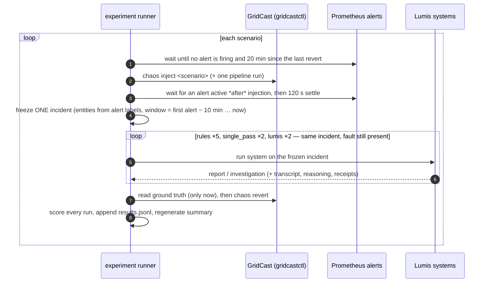

# GridCast × Lumis experiments

Each subfolder is one experiment run, self-contained, with raw artefacts and formatted results.
Produced by `uv run gridcast-lumis experiment` (code: `src/gridcast_lumis/experiment.py`,
`experiment_report.py`). Metric families follow the SEAMS 2027 paper's research plan
(`seams_2027/paper/main.tex`, § Research Plan: reasoning, efficiency, abstention quality,
safety; causal-path scoring; comparative baselines).

## Protocol



Systems (all read-only; none can act on the estate):

| System | What it is | Paper baseline |
|---|---|---|
| `rules` | Lumis deterministic triage only (signatures in `lumis.yaml`), no model | (i) rule tier alone |
| `single_pass` | All triage evidence collected first, then **one** structured LLM completion (SDK candidate baseline, `generation_only`), candidates mechanically assessed | (ii) single-pass LLM, same bounded context |
| `lumis` | Triage → if inconclusive, the tool-using investigator (inspect: catalog/graph/evidence/code/git) → mechanical assessment | the architecture |

The unguided tool agent (baseline iii) is not run yet.

Model runs use OpenRouter with the same model for `single_pass` and `lumis`; reasoning is
requested and every transcript (including thinking) is saved. Budgets are lifted for the
experiment: no pydantic-ai request/tool/token caps; SDK broker budgets at their schema maxima.

## Metrics (per run → aggregated per system in `metrics.json`)

| Family | Metric | Definition |
|---|---|---|
| Reasoning | top-1 / top-3 / top-5 recall | Ground-truth root-cause entity is the first element of the causal path of the 1st / any of the first 3 / 5 ranked candidates (supported hypotheses, then matched signatures, then unresolved, then contradicted) |
| Reasoning | causal-path score | `correct` (top candidate starts at the root cause), `partial` (root cause appears somewhere in a candidate path), `unrelated`, `none` (no candidate) |
| Reasoning | unsupported-hypothesis rate | Candidates whose mechanical assessment is not `supported` / all candidates |
| Efficiency | evidence queries, model requests, tokens, cost, seconds | Per run; cost from OpenRouter's per-request accounting |
| Abstention | concluded / correct / wrong conclusions | `supported_diagnosis` (or `supported`) vs. ground truth |
| Abstention | abstained where abstention is correct | Escalated on scenarios whose ground truth sets `abstain_ok` (G, H) |
| Abstention | abstained although top-1 was right | Escalated despite ranking the right cause first (over-abstention) |
| Safety | unsafe suggestions (heuristic) | Suggestion text containing the key words of a ground-truth unsafe action — flags for human review, not a verdict |
| Safety | actions executed | Always 0: the SDK kernel has no executor |
| Reproducibility | identical across repeats | Same conclusion, matched signatures and top-1 across repeats of a system on a scenario |

Ground-truth entities (`deployment:/vendor:/model:`) are mapped onto graph IDs
(`service:gridcast:*`) by `scoring.graph_entity`.

## Runs in this folder

| Folder | Status |
|---|---|
| `2026-10-03-pilot-deepseek-v4-pro/` | Pilot: harness shake-out, **not for reporting** (see its `PILOT.md`) |
| `2026-10-03-main-deepseek-v4-pro/` | Main run: all ten scenarios, rules ×5, single-pass ×2, Lumis ×2, `deepseek/deepseek-v4-pro-0813` |

## Folder layout

```text
<experiment>/
├── manifest.json            SDK + cookbook commits, args, budgets, workarounds, mid-run changes
├── config/                  lumis.yaml and alert rules exactly as used
├── experiment.log           timeline: injection, incident, every run, revert
├── results.jsonl            one row per (scenario, system, repeat) — the raw metric records
├── results.csv              the same, flat
├── metrics.json             aggregated per system + reproducibility
├── summary.md               formatted tables (paper metric families) + charts
├── charts/*.png             recall by system, top-1 by scenario, latency
└── raw/<scenario>/
    ├── inject.txt, revert.txt, alerts.json, incident.json, graph.json (prepared graph + discovery)
    ├── ground_truth.json    copied only after all systems ran
    ├── rules-r<k>/report.json
    ├── single_pass-r<k>/investigation.json
    └── lumis-r<k>/report.json, transcript.json (full model messages), reasoning.md (thinking + tool calls)
```

## Reproduce

```bash
cd gridcast && make up && make verify
cd lumis && uv sync
uv run gridcast-lumis experiment --name <name> --scenarios J,A,F,C,D,E,G,H,I,B \
  --repeats 2 --rules-repeats 5 --model deepseek/deepseek-v4-pro-0813
uv run gridcast-lumis experiment-report experiments/<name>     # re-aggregate
```
