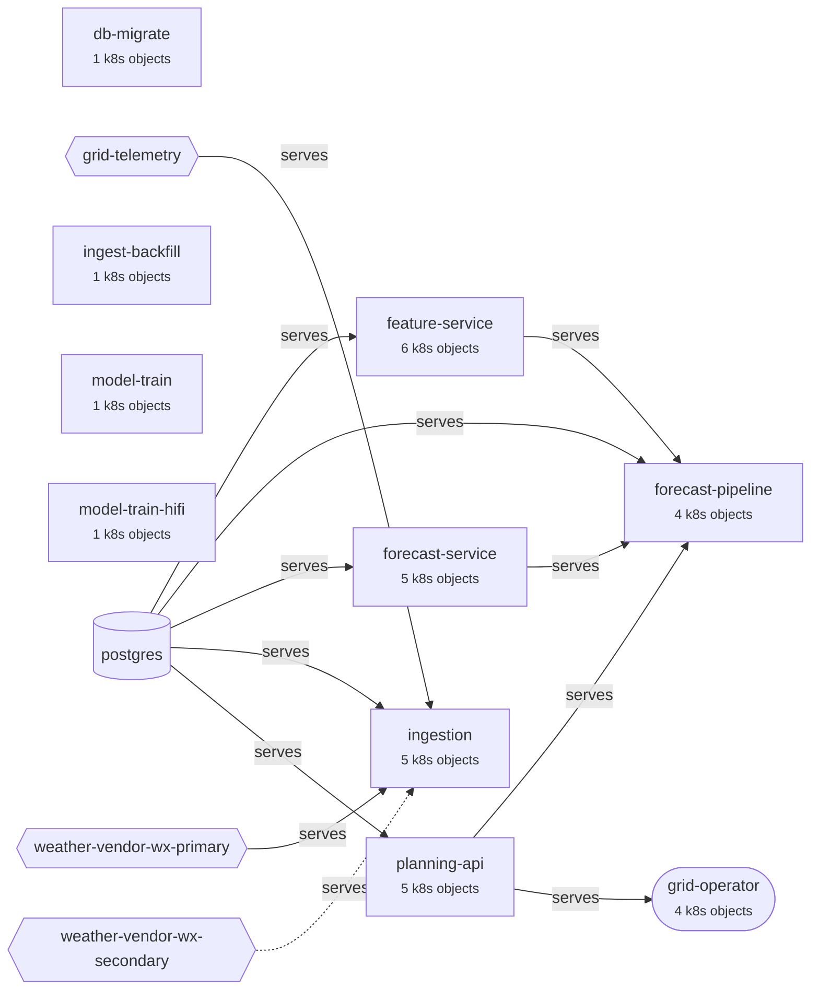

# GridCast operational graph (as Lumis sees it)

Prepared 2026-10-03 12:48 UTC from: declared (10 entities), kubernetes (43 entities), prometheus.service_graph (9 entities).
Solid edges were observed in traces (service graph); dashed edges are declared only.

